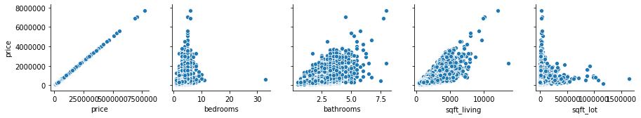
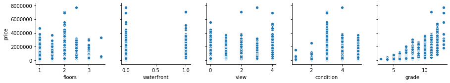
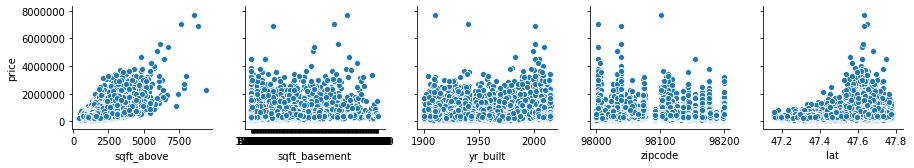
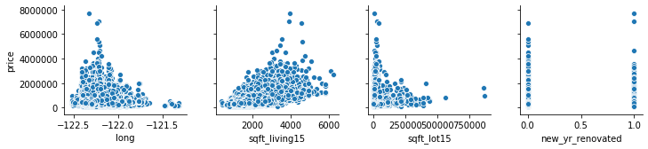
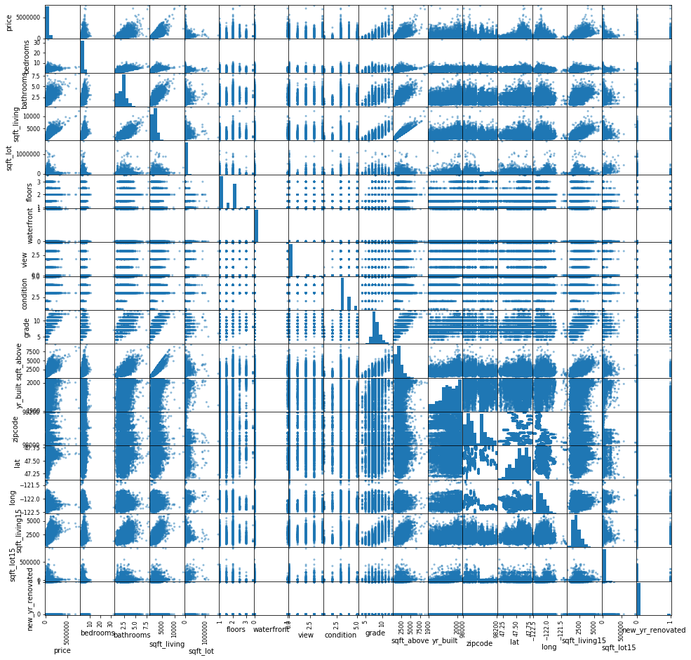
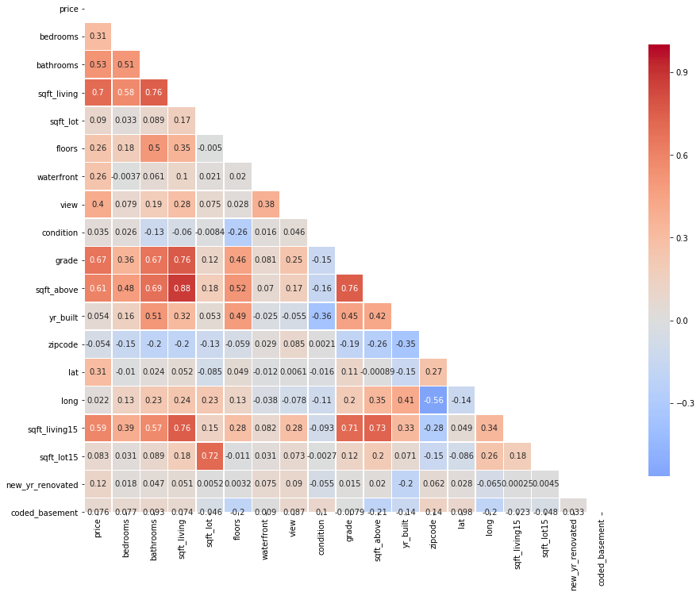
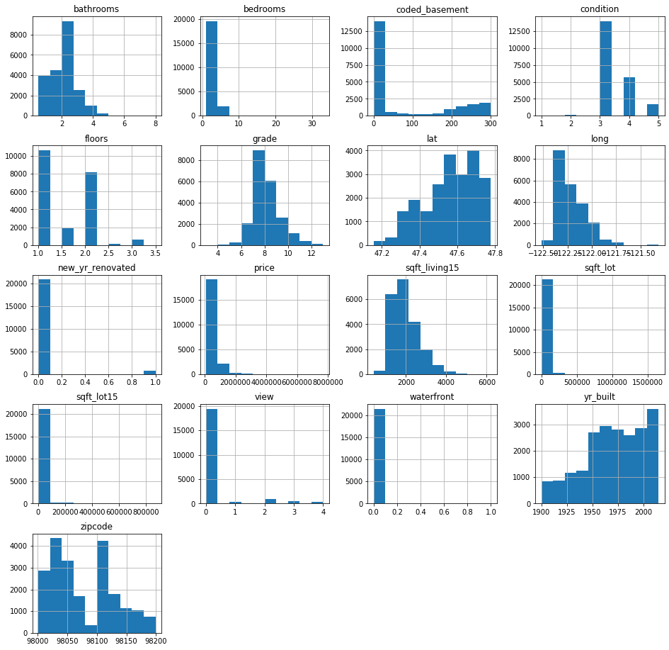
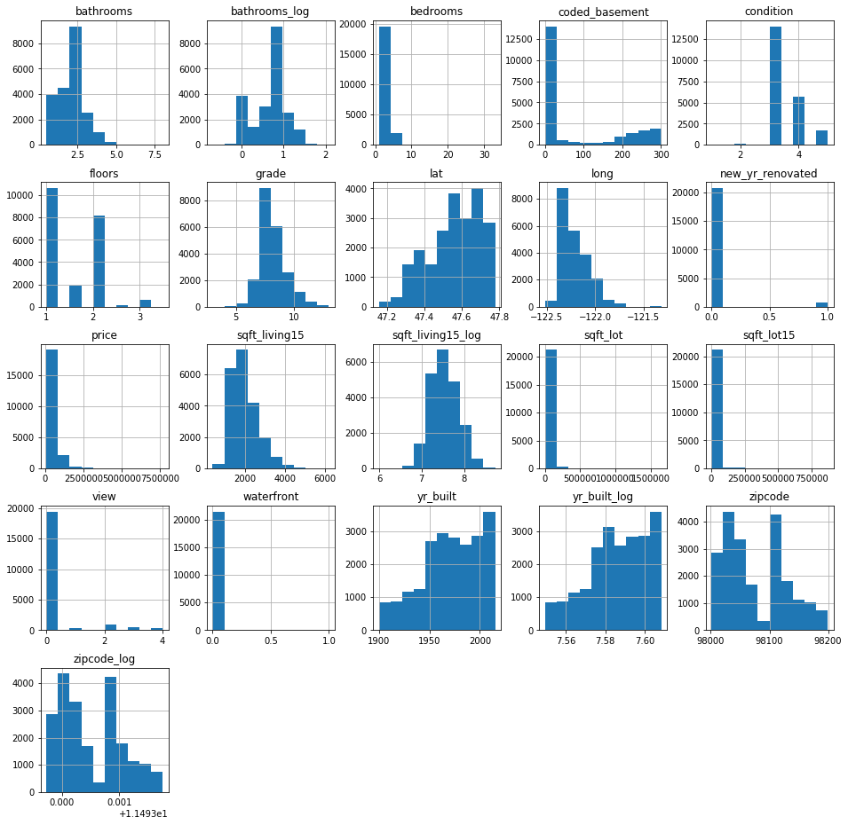
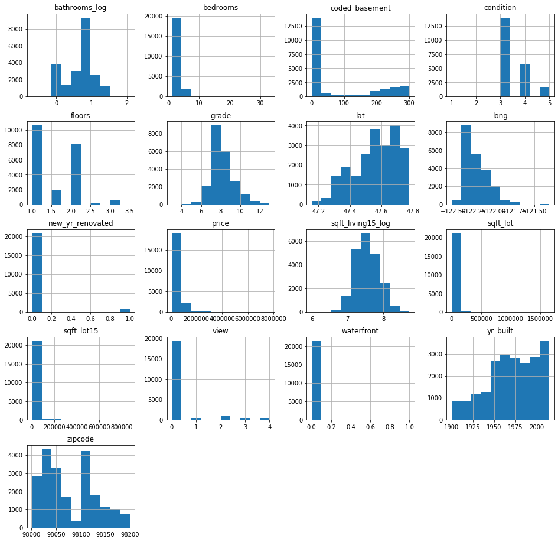

## Final Project Submission

Please fill out:
* Student name: 
* Student pace: self paced / part time / full time
* Scheduled project review date/time: 
* Instructor name: 
* Blog post URL:


# Importing Libraries and Packages


```python
#importing libraries 
import pandas as pd
import numpy as np
import seaborn as sns
import matplotlib.pyplot as plt
%matplotlib inline
from math import sqrt

#STATSMODELS
import statsmodels.api as sm
from statsmodels.formula.api import ols

#SCI-KIT LEARN
from sklearn.preprocessing import StandardScaler
from sklearn.linear_model import LinearRegression
lr = LinearRegression()
from sklearn.model_selection import train_test_split
from sklearn.model_selection import KFold
from sklearn.model_selection import cross_val_score
from sklearn.svm import SVR
import sklearn.metrics as metrics
from sklearn.metrics import mean_squared_error
```

# Introduction to Housing Data Analysis

    This analysis will look at different variables that could potential predict whether house prices will increase in King County, Washington.  The variables are taken from the King County Housing Data Set.  Before delving into the variables, I will be cleaning up the data to prepare it for engineering.  Based on the result, I am hoping to at least use 4-5 variables to predict prices.  


```python
data = pd.read_csv("kc_house_data.csv")
pd.set_option('display.max_columns' ,0) #displaying all columns 
data.head() #check first 5 rows
```


<div>
<style scoped>
    .dataframe tbody tr th:only-of-type {
        vertical-align: middle;
    }

    .dataframe tbody tr th {
        vertical-align: top;
    }

    .dataframe thead th {
        text-align: right;
    }
</style>
<table border="1" class="dataframe">
  <thead>
    <tr style="text-align: right;">
      <th></th>
      <th>id</th>
      <th>date</th>
      <th>price</th>
      <th>bedrooms</th>
      <th>bathrooms</th>
      <th>sqft_living</th>
      <th>sqft_lot</th>
      <th>floors</th>
      <th>waterfront</th>
      <th>view</th>
      <th>condition</th>
      <th>grade</th>
      <th>sqft_above</th>
      <th>sqft_basement</th>
      <th>yr_built</th>
      <th>yr_renovated</th>
      <th>zipcode</th>
      <th>lat</th>
      <th>long</th>
      <th>sqft_living15</th>
      <th>sqft_lot15</th>
    </tr>
  </thead>
  <tbody>
    <tr>
      <td>0</td>
      <td>7129300520</td>
      <td>10/13/2014</td>
      <td>221900.0</td>
      <td>3</td>
      <td>1.00</td>
      <td>1180</td>
      <td>5650</td>
      <td>1.0</td>
      <td>NaN</td>
      <td>0.0</td>
      <td>3</td>
      <td>7</td>
      <td>1180</td>
      <td>0.0</td>
      <td>1955</td>
      <td>0.0</td>
      <td>98178</td>
      <td>47.5112</td>
      <td>-122.257</td>
      <td>1340</td>
      <td>5650</td>
    </tr>
    <tr>
      <td>1</td>
      <td>6414100192</td>
      <td>12/9/2014</td>
      <td>538000.0</td>
      <td>3</td>
      <td>2.25</td>
      <td>2570</td>
      <td>7242</td>
      <td>2.0</td>
      <td>0.0</td>
      <td>0.0</td>
      <td>3</td>
      <td>7</td>
      <td>2170</td>
      <td>400.0</td>
      <td>1951</td>
      <td>1991.0</td>
      <td>98125</td>
      <td>47.7210</td>
      <td>-122.319</td>
      <td>1690</td>
      <td>7639</td>
    </tr>
    <tr>
      <td>2</td>
      <td>5631500400</td>
      <td>2/25/2015</td>
      <td>180000.0</td>
      <td>2</td>
      <td>1.00</td>
      <td>770</td>
      <td>10000</td>
      <td>1.0</td>
      <td>0.0</td>
      <td>0.0</td>
      <td>3</td>
      <td>6</td>
      <td>770</td>
      <td>0.0</td>
      <td>1933</td>
      <td>NaN</td>
      <td>98028</td>
      <td>47.7379</td>
      <td>-122.233</td>
      <td>2720</td>
      <td>8062</td>
    </tr>
    <tr>
      <td>3</td>
      <td>2487200875</td>
      <td>12/9/2014</td>
      <td>604000.0</td>
      <td>4</td>
      <td>3.00</td>
      <td>1960</td>
      <td>5000</td>
      <td>1.0</td>
      <td>0.0</td>
      <td>0.0</td>
      <td>5</td>
      <td>7</td>
      <td>1050</td>
      <td>910.0</td>
      <td>1965</td>
      <td>0.0</td>
      <td>98136</td>
      <td>47.5208</td>
      <td>-122.393</td>
      <td>1360</td>
      <td>5000</td>
    </tr>
    <tr>
      <td>4</td>
      <td>1954400510</td>
      <td>2/18/2015</td>
      <td>510000.0</td>
      <td>3</td>
      <td>2.00</td>
      <td>1680</td>
      <td>8080</td>
      <td>1.0</td>
      <td>0.0</td>
      <td>0.0</td>
      <td>3</td>
      <td>8</td>
      <td>1680</td>
      <td>0.0</td>
      <td>1987</td>
      <td>0.0</td>
      <td>98074</td>
      <td>47.6168</td>
      <td>-122.045</td>
      <td>1800</td>
      <td>7503</td>
    </tr>
  </tbody>
</table>
</div>


```python
data.tail() #check last 5 rows

```


<div>
<style scoped>
    .dataframe tbody tr th:only-of-type {
        vertical-align: middle;
    }

    .dataframe tbody tr th {
        vertical-align: top;
    }

    .dataframe thead th {
        text-align: right;
    }
</style>
<table border="1" class="dataframe">
  <thead>
    <tr style="text-align: right;">
      <th></th>
      <th>id</th>
      <th>date</th>
      <th>price</th>
      <th>bedrooms</th>
      <th>bathrooms</th>
      <th>sqft_living</th>
      <th>sqft_lot</th>
      <th>floors</th>
      <th>waterfront</th>
      <th>view</th>
      <th>condition</th>
      <th>grade</th>
      <th>sqft_above</th>
      <th>sqft_basement</th>
      <th>yr_built</th>
      <th>yr_renovated</th>
      <th>zipcode</th>
      <th>lat</th>
      <th>long</th>
      <th>sqft_living15</th>
      <th>sqft_lot15</th>
    </tr>
  </thead>
  <tbody>
    <tr>
      <td>21592</td>
      <td>263000018</td>
      <td>5/21/2014</td>
      <td>360000.0</td>
      <td>3</td>
      <td>2.50</td>
      <td>1530</td>
      <td>1131</td>
      <td>3.0</td>
      <td>0.0</td>
      <td>0.0</td>
      <td>3</td>
      <td>8</td>
      <td>1530</td>
      <td>0.0</td>
      <td>2009</td>
      <td>0.0</td>
      <td>98103</td>
      <td>47.6993</td>
      <td>-122.346</td>
      <td>1530</td>
      <td>1509</td>
    </tr>
    <tr>
      <td>21593</td>
      <td>6600060120</td>
      <td>2/23/2015</td>
      <td>400000.0</td>
      <td>4</td>
      <td>2.50</td>
      <td>2310</td>
      <td>5813</td>
      <td>2.0</td>
      <td>0.0</td>
      <td>0.0</td>
      <td>3</td>
      <td>8</td>
      <td>2310</td>
      <td>0.0</td>
      <td>2014</td>
      <td>0.0</td>
      <td>98146</td>
      <td>47.5107</td>
      <td>-122.362</td>
      <td>1830</td>
      <td>7200</td>
    </tr>
    <tr>
      <td>21594</td>
      <td>1523300141</td>
      <td>6/23/2014</td>
      <td>402101.0</td>
      <td>2</td>
      <td>0.75</td>
      <td>1020</td>
      <td>1350</td>
      <td>2.0</td>
      <td>0.0</td>
      <td>0.0</td>
      <td>3</td>
      <td>7</td>
      <td>1020</td>
      <td>0.0</td>
      <td>2009</td>
      <td>0.0</td>
      <td>98144</td>
      <td>47.5944</td>
      <td>-122.299</td>
      <td>1020</td>
      <td>2007</td>
    </tr>
    <tr>
      <td>21595</td>
      <td>291310100</td>
      <td>1/16/2015</td>
      <td>400000.0</td>
      <td>3</td>
      <td>2.50</td>
      <td>1600</td>
      <td>2388</td>
      <td>2.0</td>
      <td>NaN</td>
      <td>0.0</td>
      <td>3</td>
      <td>8</td>
      <td>1600</td>
      <td>0.0</td>
      <td>2004</td>
      <td>0.0</td>
      <td>98027</td>
      <td>47.5345</td>
      <td>-122.069</td>
      <td>1410</td>
      <td>1287</td>
    </tr>
    <tr>
      <td>21596</td>
      <td>1523300157</td>
      <td>10/15/2014</td>
      <td>325000.0</td>
      <td>2</td>
      <td>0.75</td>
      <td>1020</td>
      <td>1076</td>
      <td>2.0</td>
      <td>0.0</td>
      <td>0.0</td>
      <td>3</td>
      <td>7</td>
      <td>1020</td>
      <td>0.0</td>
      <td>2008</td>
      <td>0.0</td>
      <td>98144</td>
      <td>47.5941</td>
      <td>-122.299</td>
      <td>1020</td>
      <td>1357</td>
    </tr>
  </tbody>
</table>
</div>


```python
column_names = data.columns #list of all column names 
print(column_names)
```

    Index(['id', 'date', 'price', 'bedrooms', 'bathrooms', 'sqft_living',
           'sqft_lot', 'floors', 'waterfront', 'view', 'condition', 'grade',
           'sqft_above', 'sqft_basement', 'yr_built', 'yr_renovated', 'zipcode',
           'lat', 'long', 'sqft_living15', 'sqft_lot15'],
          dtype='object')


# Column Names and descriptions for Kings County Data Set¶

* **id** - unique identified for a house
* **dateDate** - house was sold
* **pricePrice** -  is prediction target
* **bedroomsNumber** -  of Bedrooms/House
* **bathroomsNumber** -  of bathrooms/bedrooms
* **sqft_livingsquare** -  footage of the home
* **sqft_lotsquare** -  footage of the lot
* **floorsTotal** -  floors (levels) in house
* **waterfront** - House which has a view to a waterfront
* **view** - Has been viewed
* **condition** - How good the condition is ( Overall )
* **grade** - overall grade given to the housing unit, based on King County grading system
* **sqft_above** - square footage of house apart from basement
* **sqft_basement** - square footage of the basement
* **yr_built** - Built Year
* **yr_renovated** - Year when house was renovated
* **zipcode** - zip
* **lat** - Latitude coordinate
* **long** - Longitude coordinate
* **sqft_living15** - The square footage of interior housing living space for the nearest 15 neighbors
* **sqft_lot15** - The square footage of the land lots of the nearest 15 neighbors


```python
data.info() #housing data information and also to see if there are any missing values

```

    <class 'pandas.core.frame.DataFrame'>
    RangeIndex: 21597 entries, 0 to 21596
    Data columns (total 21 columns):
    id               21597 non-null int64
    date             21597 non-null object
    price            21597 non-null float64
    bedrooms         21597 non-null int64
    bathrooms        21597 non-null float64
    sqft_living      21597 non-null int64
    sqft_lot         21597 non-null int64
    floors           21597 non-null float64
    waterfront       19221 non-null float64
    view             21534 non-null float64
    condition        21597 non-null int64
    grade            21597 non-null int64
    sqft_above       21597 non-null int64
    sqft_basement    21597 non-null object
    yr_built         21597 non-null int64
    yr_renovated     17755 non-null float64
    zipcode          21597 non-null int64
    lat              21597 non-null float64
    long             21597 non-null float64
    sqft_living15    21597 non-null int64
    sqft_lot15       21597 non-null int64
    dtypes: float64(8), int64(11), object(2)
    memory usage: 3.5+ MB


# Observation:

* There are a total of 21,597 rows and 21 columns
* 3 Columns (waterfront, view, yr_renovated,) seems to have some data missing.
* waterfront, view, and condition seem to be categorical
* date, sqft_basement are classified as objects
* sqft_basement not all houses have basements and is also marked as an object


# Getting Rid of Columns that does not really contribute informatin

* Dropping **id** and **date**


```python
data.drop(['id','date'], axis = 1, inplace =True)# in place TRUE to make sure that the dropped is successful within the dataframe
```


```python
data.head()#columns dropped

```


<div>
<style scoped>
    .dataframe tbody tr th:only-of-type {
        vertical-align: middle;
    }

    .dataframe tbody tr th {
        vertical-align: top;
    }

    .dataframe thead th {
        text-align: right;
    }
</style>
<table border="1" class="dataframe">
  <thead>
    <tr style="text-align: right;">
      <th></th>
      <th>price</th>
      <th>bedrooms</th>
      <th>bathrooms</th>
      <th>sqft_living</th>
      <th>sqft_lot</th>
      <th>floors</th>
      <th>waterfront</th>
      <th>view</th>
      <th>condition</th>
      <th>grade</th>
      <th>sqft_above</th>
      <th>sqft_basement</th>
      <th>yr_built</th>
      <th>yr_renovated</th>
      <th>zipcode</th>
      <th>lat</th>
      <th>long</th>
      <th>sqft_living15</th>
      <th>sqft_lot15</th>
    </tr>
  </thead>
  <tbody>
    <tr>
      <td>0</td>
      <td>221900.0</td>
      <td>3</td>
      <td>1.00</td>
      <td>1180</td>
      <td>5650</td>
      <td>1.0</td>
      <td>NaN</td>
      <td>0.0</td>
      <td>3</td>
      <td>7</td>
      <td>1180</td>
      <td>0.0</td>
      <td>1955</td>
      <td>0.0</td>
      <td>98178</td>
      <td>47.5112</td>
      <td>-122.257</td>
      <td>1340</td>
      <td>5650</td>
    </tr>
    <tr>
      <td>1</td>
      <td>538000.0</td>
      <td>3</td>
      <td>2.25</td>
      <td>2570</td>
      <td>7242</td>
      <td>2.0</td>
      <td>0.0</td>
      <td>0.0</td>
      <td>3</td>
      <td>7</td>
      <td>2170</td>
      <td>400.0</td>
      <td>1951</td>
      <td>1991.0</td>
      <td>98125</td>
      <td>47.7210</td>
      <td>-122.319</td>
      <td>1690</td>
      <td>7639</td>
    </tr>
    <tr>
      <td>2</td>
      <td>180000.0</td>
      <td>2</td>
      <td>1.00</td>
      <td>770</td>
      <td>10000</td>
      <td>1.0</td>
      <td>0.0</td>
      <td>0.0</td>
      <td>3</td>
      <td>6</td>
      <td>770</td>
      <td>0.0</td>
      <td>1933</td>
      <td>NaN</td>
      <td>98028</td>
      <td>47.7379</td>
      <td>-122.233</td>
      <td>2720</td>
      <td>8062</td>
    </tr>
    <tr>
      <td>3</td>
      <td>604000.0</td>
      <td>4</td>
      <td>3.00</td>
      <td>1960</td>
      <td>5000</td>
      <td>1.0</td>
      <td>0.0</td>
      <td>0.0</td>
      <td>5</td>
      <td>7</td>
      <td>1050</td>
      <td>910.0</td>
      <td>1965</td>
      <td>0.0</td>
      <td>98136</td>
      <td>47.5208</td>
      <td>-122.393</td>
      <td>1360</td>
      <td>5000</td>
    </tr>
    <tr>
      <td>4</td>
      <td>510000.0</td>
      <td>3</td>
      <td>2.00</td>
      <td>1680</td>
      <td>8080</td>
      <td>1.0</td>
      <td>0.0</td>
      <td>0.0</td>
      <td>3</td>
      <td>8</td>
      <td>1680</td>
      <td>0.0</td>
      <td>1987</td>
      <td>0.0</td>
      <td>98074</td>
      <td>47.6168</td>
      <td>-122.045</td>
      <td>1800</td>
      <td>7503</td>
    </tr>
  </tbody>
</table>
</div>


```python
data.isna().sum() #looking at how much missing data 
nulls = data.isnull().sum() #nice trick from James to whittle down which columns have missing data 
print(nulls[nulls > 0])
```

    waterfront      2376
    view              63
    yr_renovated    3842
    dtype: int64


```python
data.dropna(subset = ['view'], inplace = True)#dropping rows in view since it's missing less than 1% of values
```


```python
data.isnull().sum() / len(data.index) #checking again and now view has 0% missing data
                                      #what to do with the rest?
```


    price            0.000000
    bedrooms         0.000000
    bathrooms        0.000000
    sqft_living      0.000000
    sqft_lot         0.000000
    floors           0.000000
    waterfront       0.110059
    view             0.000000
    condition        0.000000
    grade            0.000000
    sqft_above       0.000000
    sqft_basement    0.000000
    yr_built         0.000000
    yr_renovated     0.177858
    zipcode          0.000000
    lat              0.000000
    long             0.000000
    sqft_living15    0.000000
    sqft_lot15       0.000000
    dtype: float64


```python
data['waterfront'].describe()
```


    count    19164.000000
    mean         0.007566
    std          0.086657
    min          0.000000
    25%          0.000000
    50%          0.000000
    75%          0.000000
    max          1.000000
    Name: waterfront, dtype: float64


```python
data['waterfront'].fillna(data['waterfront'].median(), inplace=True)
```


```python
data.isnull().sum() / len(data.index)
```


    price            0.000000
    bedrooms         0.000000
    bathrooms        0.000000
    sqft_living      0.000000
    sqft_lot         0.000000
    floors           0.000000
    waterfront       0.000000
    view             0.000000
    condition        0.000000
    grade            0.000000
    sqft_above       0.000000
    sqft_basement    0.000000
    yr_built         0.000000
    yr_renovated     0.177858
    zipcode          0.000000
    lat              0.000000
    long             0.000000
    sqft_living15    0.000000
    sqft_lot15       0.000000
    dtype: float64


```python
data['yr_renovated'].describe()
```


    count    17704.000000
    mean        83.765025
    std        400.239690
    min          0.000000
    25%          0.000000
    50%          0.000000
    75%          0.000000
    max       2015.000000
    Name: yr_renovated, dtype: float64


```python
data.groupby('yr_renovated')['price'].describe().round(3)#i see that for yr_renovated with NaN, std = mean
```


<div>
<style scoped>
    .dataframe tbody tr th:only-of-type {
        vertical-align: middle;
    }

    .dataframe tbody tr th {
        vertical-align: top;
    }

    .dataframe thead th {
        text-align: right;
    }
</style>
<table border="1" class="dataframe">
  <thead>
    <tr style="text-align: right;">
      <th></th>
      <th>count</th>
      <th>mean</th>
      <th>std</th>
      <th>min</th>
      <th>25%</th>
      <th>50%</th>
      <th>75%</th>
      <th>max</th>
    </tr>
    <tr>
      <th>yr_renovated</th>
      <th></th>
      <th></th>
      <th></th>
      <th></th>
      <th></th>
      <th></th>
      <th></th>
      <th></th>
    </tr>
  </thead>
  <tbody>
    <tr>
      <td>0.0</td>
      <td>16961.0</td>
      <td>530401.031</td>
      <td>348593.885</td>
      <td>80000.0</td>
      <td>320000.0</td>
      <td>447500.0</td>
      <td>633000.0</td>
      <td>6890000.0</td>
    </tr>
    <tr>
      <td>1934.0</td>
      <td>1.0</td>
      <td>459950.000</td>
      <td>NaN</td>
      <td>459950.0</td>
      <td>459950.0</td>
      <td>459950.0</td>
      <td>459950.0</td>
      <td>459950.0</td>
    </tr>
    <tr>
      <td>1940.0</td>
      <td>2.0</td>
      <td>378400.000</td>
      <td>92065.303</td>
      <td>313300.0</td>
      <td>345850.0</td>
      <td>378400.0</td>
      <td>410950.0</td>
      <td>443500.0</td>
    </tr>
    <tr>
      <td>1944.0</td>
      <td>1.0</td>
      <td>521000.000</td>
      <td>NaN</td>
      <td>521000.0</td>
      <td>521000.0</td>
      <td>521000.0</td>
      <td>521000.0</td>
      <td>521000.0</td>
    </tr>
    <tr>
      <td>1945.0</td>
      <td>3.0</td>
      <td>398666.667</td>
      <td>155853.564</td>
      <td>256000.0</td>
      <td>315500.0</td>
      <td>375000.0</td>
      <td>470000.0</td>
      <td>565000.0</td>
    </tr>
    <tr>
      <td>...</td>
      <td>...</td>
      <td>...</td>
      <td>...</td>
      <td>...</td>
      <td>...</td>
      <td>...</td>
      <td>...</td>
      <td>...</td>
    </tr>
    <tr>
      <td>2011.0</td>
      <td>9.0</td>
      <td>531416.667</td>
      <td>194776.956</td>
      <td>329000.0</td>
      <td>378750.0</td>
      <td>507000.0</td>
      <td>650000.0</td>
      <td>831000.0</td>
    </tr>
    <tr>
      <td>2012.0</td>
      <td>8.0</td>
      <td>633375.000</td>
      <td>256891.132</td>
      <td>294000.0</td>
      <td>475000.0</td>
      <td>568750.0</td>
      <td>888750.0</td>
      <td>970500.0</td>
    </tr>
    <tr>
      <td>2013.0</td>
      <td>31.0</td>
      <td>674275.806</td>
      <td>445043.415</td>
      <td>224000.0</td>
      <td>402250.0</td>
      <td>570000.0</td>
      <td>854400.0</td>
      <td>2500000.0</td>
    </tr>
    <tr>
      <td>2014.0</td>
      <td>73.0</td>
      <td>666537.521</td>
      <td>327087.003</td>
      <td>199990.0</td>
      <td>433000.0</td>
      <td>599000.0</td>
      <td>811000.0</td>
      <td>1700000.0</td>
    </tr>
    <tr>
      <td>2015.0</td>
      <td>14.0</td>
      <td>697464.286</td>
      <td>308677.356</td>
      <td>285000.0</td>
      <td>463250.0</td>
      <td>761000.0</td>
      <td>828750.0</td>
      <td>1490000.0</td>
    </tr>
  </tbody>
</table>
<p>70 rows × 8 columns</p>
</div>


```python
data['yr_renovated'].replace(0.0,np.nan,inplace=True)# Using Binary Code and creating new column that makes it easier whether a house has been renovated (1) or not (0)

```


```python
nan = data['yr_renovated'].loc[data['yr_renovated'].isna()].index #getting index to create a new column 
notnan = data['yr_renovated'].loc[~data['yr_renovated'].isna()].index
```


```python
data['new_yr_renovated'] = data['yr_renovated'].copy 
data['new_yr_renovated'][nan] = 0
data['new_yr_renovated'][notnan] = 1

data.info()
```

    <class 'pandas.core.frame.DataFrame'>
    Int64Index: 21534 entries, 0 to 21596
    Data columns (total 20 columns):
    price               21534 non-null float64
    bedrooms            21534 non-null int64
    bathrooms           21534 non-null float64
    sqft_living         21534 non-null int64
    sqft_lot            21534 non-null int64
    floors              21534 non-null float64
    waterfront          21534 non-null float64
    view                21534 non-null float64
    condition           21534 non-null int64
    grade               21534 non-null int64
    sqft_above          21534 non-null int64
    sqft_basement       21534 non-null object
    yr_built            21534 non-null int64
    yr_renovated        743 non-null float64
    zipcode             21534 non-null int64
    lat                 21534 non-null float64
    long                21534 non-null float64
    sqft_living15       21534 non-null int64
    sqft_lot15          21534 non-null int64
    new_yr_renovated    21534 non-null int64
    dtypes: float64(8), int64(11), object(1)
    memory usage: 4.1+ MB


    /Users/john.ofrecio/opt/anaconda3/envs/learn-env/lib/python3.6/site-packages/ipykernel_launcher.py:2: SettingWithCopyWarning: 
    A value is trying to be set on a copy of a slice from a DataFrame
    
    See the caveats in the documentation: http://pandas.pydata.org/pandas-docs/stable/user_guide/indexing.html#returning-a-view-versus-a-copy
      
    /Users/john.ofrecio/opt/anaconda3/envs/learn-env/lib/python3.6/site-packages/ipykernel_launcher.py:3: SettingWithCopyWarning: 
    A value is trying to be set on a copy of a slice from a DataFrame
    
    See the caveats in the documentation: http://pandas.pydata.org/pandas-docs/stable/user_guide/indexing.html#returning-a-view-versus-a-copy
      This is separate from the ipykernel package so we can avoid doing imports until


```python
data.drop(['yr_renovated'], axis = 1, inplace =True) #dropping yr_renovated
```


```python
data.isnull().sum() / len(data.index) #no more missing data

```


    price               0.0
    bedrooms            0.0
    bathrooms           0.0
    sqft_living         0.0
    sqft_lot            0.0
    floors              0.0
    waterfront          0.0
    view                0.0
    condition           0.0
    grade               0.0
    sqft_above          0.0
    sqft_basement       0.0
    yr_built            0.0
    zipcode             0.0
    lat                 0.0
    long                0.0
    sqft_living15       0.0
    sqft_lot15          0.0
    new_yr_renovated    0.0
    dtype: float64


# Categorical Values


```python
for i in range(0, len(data.columns), 5): #visualizing comparing characteristics to price 
    sns.pairplot(data=data,
                x_vars=data.columns[i:i+5],
                y_vars=['price'])
```














```python
data.describe().round(3)
```


<div>
<style scoped>
    .dataframe tbody tr th:only-of-type {
        vertical-align: middle;
    }

    .dataframe tbody tr th {
        vertical-align: top;
    }

    .dataframe thead th {
        text-align: right;
    }
</style>
<table border="1" class="dataframe">
  <thead>
    <tr style="text-align: right;">
      <th></th>
      <th>price</th>
      <th>bedrooms</th>
      <th>bathrooms</th>
      <th>sqft_living</th>
      <th>sqft_lot</th>
      <th>floors</th>
      <th>waterfront</th>
      <th>view</th>
      <th>condition</th>
      <th>grade</th>
      <th>sqft_above</th>
      <th>yr_built</th>
      <th>zipcode</th>
      <th>lat</th>
      <th>long</th>
      <th>sqft_living15</th>
      <th>sqft_lot15</th>
      <th>new_yr_renovated</th>
    </tr>
  </thead>
  <tbody>
    <tr>
      <td>count</td>
      <td>21534.000</td>
      <td>21534.000</td>
      <td>21534.000</td>
      <td>21534.000</td>
      <td>21534.000</td>
      <td>21534.000</td>
      <td>21534.000</td>
      <td>21534.000</td>
      <td>21534.000</td>
      <td>21534.000</td>
      <td>21534.000</td>
      <td>21534.000</td>
      <td>21534.000</td>
      <td>21534.000</td>
      <td>21534.000</td>
      <td>21534.000</td>
      <td>21534.000</td>
      <td>21534.000</td>
    </tr>
    <tr>
      <td>mean</td>
      <td>540057.664</td>
      <td>3.373</td>
      <td>2.116</td>
      <td>2079.828</td>
      <td>15090.596</td>
      <td>1.494</td>
      <td>0.007</td>
      <td>0.234</td>
      <td>3.410</td>
      <td>7.657</td>
      <td>1788.558</td>
      <td>1971.002</td>
      <td>98077.939</td>
      <td>47.560</td>
      <td>-122.214</td>
      <td>1986.300</td>
      <td>12751.080</td>
      <td>0.035</td>
    </tr>
    <tr>
      <td>std</td>
      <td>366059.581</td>
      <td>0.926</td>
      <td>0.769</td>
      <td>917.447</td>
      <td>41380.210</td>
      <td>0.540</td>
      <td>0.082</td>
      <td>0.766</td>
      <td>0.651</td>
      <td>1.173</td>
      <td>827.746</td>
      <td>29.376</td>
      <td>53.507</td>
      <td>0.139</td>
      <td>0.141</td>
      <td>685.121</td>
      <td>27255.483</td>
      <td>0.183</td>
    </tr>
    <tr>
      <td>min</td>
      <td>78000.000</td>
      <td>1.000</td>
      <td>0.500</td>
      <td>370.000</td>
      <td>520.000</td>
      <td>1.000</td>
      <td>0.000</td>
      <td>0.000</td>
      <td>1.000</td>
      <td>3.000</td>
      <td>370.000</td>
      <td>1900.000</td>
      <td>98001.000</td>
      <td>47.156</td>
      <td>-122.519</td>
      <td>399.000</td>
      <td>651.000</td>
      <td>0.000</td>
    </tr>
    <tr>
      <td>25%</td>
      <td>322000.000</td>
      <td>3.000</td>
      <td>1.750</td>
      <td>1430.000</td>
      <td>5040.000</td>
      <td>1.000</td>
      <td>0.000</td>
      <td>0.000</td>
      <td>3.000</td>
      <td>7.000</td>
      <td>1190.000</td>
      <td>1951.000</td>
      <td>98033.000</td>
      <td>47.471</td>
      <td>-122.328</td>
      <td>1490.000</td>
      <td>5100.000</td>
      <td>0.000</td>
    </tr>
    <tr>
      <td>50%</td>
      <td>450000.000</td>
      <td>3.000</td>
      <td>2.250</td>
      <td>1910.000</td>
      <td>7617.000</td>
      <td>1.500</td>
      <td>0.000</td>
      <td>0.000</td>
      <td>3.000</td>
      <td>7.000</td>
      <td>1560.000</td>
      <td>1975.000</td>
      <td>98065.000</td>
      <td>47.572</td>
      <td>-122.230</td>
      <td>1840.000</td>
      <td>7620.000</td>
      <td>0.000</td>
    </tr>
    <tr>
      <td>75%</td>
      <td>645000.000</td>
      <td>4.000</td>
      <td>2.500</td>
      <td>2550.000</td>
      <td>10687.750</td>
      <td>2.000</td>
      <td>0.000</td>
      <td>0.000</td>
      <td>4.000</td>
      <td>8.000</td>
      <td>2210.000</td>
      <td>1997.000</td>
      <td>98118.000</td>
      <td>47.678</td>
      <td>-122.125</td>
      <td>2360.000</td>
      <td>10083.000</td>
      <td>0.000</td>
    </tr>
    <tr>
      <td>max</td>
      <td>7700000.000</td>
      <td>33.000</td>
      <td>8.000</td>
      <td>13540.000</td>
      <td>1651359.000</td>
      <td>3.500</td>
      <td>1.000</td>
      <td>4.000</td>
      <td>5.000</td>
      <td>13.000</td>
      <td>9410.000</td>
      <td>2015.000</td>
      <td>98199.000</td>
      <td>47.778</td>
      <td>-121.315</td>
      <td>6210.000</td>
      <td>871200.000</td>
      <td>1.000</td>
    </tr>
  </tbody>
</table>
</div>


```python
fig = pd.plotting.scatter_matrix(data, figsize=(16,16));

```





# Observation

* **Categorical Values**:view, waterfront, zipcode
* **Ordinal Data**: bedrooms, bathrooms, floors, view, grade

#Transforming Categorical Values


```python
data.info() #sqft_basement is an object
```

    <class 'pandas.core.frame.DataFrame'>
    Int64Index: 21534 entries, 0 to 21596
    Data columns (total 19 columns):
    price               21534 non-null float64
    bedrooms            21534 non-null int64
    bathrooms           21534 non-null float64
    sqft_living         21534 non-null int64
    sqft_lot            21534 non-null int64
    floors              21534 non-null float64
    waterfront          21534 non-null float64
    view                21534 non-null float64
    condition           21534 non-null int64
    grade               21534 non-null int64
    sqft_above          21534 non-null int64
    sqft_basement       21534 non-null object
    yr_built            21534 non-null int64
    zipcode             21534 non-null int64
    lat                 21534 non-null float64
    long                21534 non-null float64
    sqft_living15       21534 non-null int64
    sqft_lot15          21534 non-null int64
    new_yr_renovated    21534 non-null int64
    dtypes: float64(7), int64(11), object(1)
    memory usage: 3.9+ MB


```python
basement = data['sqft_basement']
basement_series = pd.Series(basement)
basement_series
```


    0          0.0
    1        400.0
    2          0.0
    3        910.0
    4          0.0
             ...  
    21592      0.0
    21593      0.0
    21594      0.0
    21595      0.0
    21596      0.0
    Name: sqft_basement, Length: 21534, dtype: object


```python
basement_series.describe()
```


    count     21534
    unique      302
    top         0.0
    freq      12798
    Name: sqft_basement, dtype: object


```python
cat_basement = basement_series.astype('category')
cat_basement
```


    0          0.0
    1        400.0
    2          0.0
    3        910.0
    4          0.0
             ...  
    21592      0.0
    21593      0.0
    21594      0.0
    21595      0.0
    21596      0.0
    Name: sqft_basement, Length: 21534, dtype: category
    Categories (302, object): [0.0, 10.0, 100.0, 1000.0, ..., 970.0, 980.0, 990.0, ?]


```python
coded_basement = cat_basement.cat.codes
coded_basement
```


    0          0
    1        207
    2          0
    3        289
    4          0
            ... 
    21592      0
    21593      0
    21594      0
    21595      0
    21596      0
    Length: 21534, dtype: int16


```python
data['coded_basement'] = coded_basement
data.head()
```


<div>
<style scoped>
    .dataframe tbody tr th:only-of-type {
        vertical-align: middle;
    }

    .dataframe tbody tr th {
        vertical-align: top;
    }

    .dataframe thead th {
        text-align: right;
    }
</style>
<table border="1" class="dataframe">
  <thead>
    <tr style="text-align: right;">
      <th></th>
      <th>price</th>
      <th>bedrooms</th>
      <th>bathrooms</th>
      <th>sqft_living</th>
      <th>sqft_lot</th>
      <th>floors</th>
      <th>waterfront</th>
      <th>view</th>
      <th>condition</th>
      <th>grade</th>
      <th>sqft_above</th>
      <th>sqft_basement</th>
      <th>yr_built</th>
      <th>zipcode</th>
      <th>lat</th>
      <th>long</th>
      <th>sqft_living15</th>
      <th>sqft_lot15</th>
      <th>new_yr_renovated</th>
      <th>coded_basement</th>
    </tr>
  </thead>
  <tbody>
    <tr>
      <td>0</td>
      <td>221900.0</td>
      <td>3</td>
      <td>1.00</td>
      <td>1180</td>
      <td>5650</td>
      <td>1.0</td>
      <td>0.0</td>
      <td>0.0</td>
      <td>3</td>
      <td>7</td>
      <td>1180</td>
      <td>0.0</td>
      <td>1955</td>
      <td>98178</td>
      <td>47.5112</td>
      <td>-122.257</td>
      <td>1340</td>
      <td>5650</td>
      <td>0</td>
      <td>0</td>
    </tr>
    <tr>
      <td>1</td>
      <td>538000.0</td>
      <td>3</td>
      <td>2.25</td>
      <td>2570</td>
      <td>7242</td>
      <td>2.0</td>
      <td>0.0</td>
      <td>0.0</td>
      <td>3</td>
      <td>7</td>
      <td>2170</td>
      <td>400.0</td>
      <td>1951</td>
      <td>98125</td>
      <td>47.7210</td>
      <td>-122.319</td>
      <td>1690</td>
      <td>7639</td>
      <td>1</td>
      <td>207</td>
    </tr>
    <tr>
      <td>2</td>
      <td>180000.0</td>
      <td>2</td>
      <td>1.00</td>
      <td>770</td>
      <td>10000</td>
      <td>1.0</td>
      <td>0.0</td>
      <td>0.0</td>
      <td>3</td>
      <td>6</td>
      <td>770</td>
      <td>0.0</td>
      <td>1933</td>
      <td>98028</td>
      <td>47.7379</td>
      <td>-122.233</td>
      <td>2720</td>
      <td>8062</td>
      <td>0</td>
      <td>0</td>
    </tr>
    <tr>
      <td>3</td>
      <td>604000.0</td>
      <td>4</td>
      <td>3.00</td>
      <td>1960</td>
      <td>5000</td>
      <td>1.0</td>
      <td>0.0</td>
      <td>0.0</td>
      <td>5</td>
      <td>7</td>
      <td>1050</td>
      <td>910.0</td>
      <td>1965</td>
      <td>98136</td>
      <td>47.5208</td>
      <td>-122.393</td>
      <td>1360</td>
      <td>5000</td>
      <td>0</td>
      <td>289</td>
    </tr>
    <tr>
      <td>4</td>
      <td>510000.0</td>
      <td>3</td>
      <td>2.00</td>
      <td>1680</td>
      <td>8080</td>
      <td>1.0</td>
      <td>0.0</td>
      <td>0.0</td>
      <td>3</td>
      <td>8</td>
      <td>1680</td>
      <td>0.0</td>
      <td>1987</td>
      <td>98074</td>
      <td>47.6168</td>
      <td>-122.045</td>
      <td>1800</td>
      <td>7503</td>
      <td>0</td>
      <td>0</td>
    </tr>
  </tbody>
</table>
</div>


```python
data.drop(['sqft_basement'], axis = 1, inplace = True)
data.head()
```


<div>
<style scoped>
    .dataframe tbody tr th:only-of-type {
        vertical-align: middle;
    }

    .dataframe tbody tr th {
        vertical-align: top;
    }

    .dataframe thead th {
        text-align: right;
    }
</style>
<table border="1" class="dataframe">
  <thead>
    <tr style="text-align: right;">
      <th></th>
      <th>price</th>
      <th>bedrooms</th>
      <th>bathrooms</th>
      <th>sqft_living</th>
      <th>sqft_lot</th>
      <th>floors</th>
      <th>waterfront</th>
      <th>view</th>
      <th>condition</th>
      <th>grade</th>
      <th>sqft_above</th>
      <th>yr_built</th>
      <th>zipcode</th>
      <th>lat</th>
      <th>long</th>
      <th>sqft_living15</th>
      <th>sqft_lot15</th>
      <th>new_yr_renovated</th>
      <th>coded_basement</th>
    </tr>
  </thead>
  <tbody>
    <tr>
      <td>0</td>
      <td>221900.0</td>
      <td>3</td>
      <td>1.00</td>
      <td>1180</td>
      <td>5650</td>
      <td>1.0</td>
      <td>0.0</td>
      <td>0.0</td>
      <td>3</td>
      <td>7</td>
      <td>1180</td>
      <td>1955</td>
      <td>98178</td>
      <td>47.5112</td>
      <td>-122.257</td>
      <td>1340</td>
      <td>5650</td>
      <td>0</td>
      <td>0</td>
    </tr>
    <tr>
      <td>1</td>
      <td>538000.0</td>
      <td>3</td>
      <td>2.25</td>
      <td>2570</td>
      <td>7242</td>
      <td>2.0</td>
      <td>0.0</td>
      <td>0.0</td>
      <td>3</td>
      <td>7</td>
      <td>2170</td>
      <td>1951</td>
      <td>98125</td>
      <td>47.7210</td>
      <td>-122.319</td>
      <td>1690</td>
      <td>7639</td>
      <td>1</td>
      <td>207</td>
    </tr>
    <tr>
      <td>2</td>
      <td>180000.0</td>
      <td>2</td>
      <td>1.00</td>
      <td>770</td>
      <td>10000</td>
      <td>1.0</td>
      <td>0.0</td>
      <td>0.0</td>
      <td>3</td>
      <td>6</td>
      <td>770</td>
      <td>1933</td>
      <td>98028</td>
      <td>47.7379</td>
      <td>-122.233</td>
      <td>2720</td>
      <td>8062</td>
      <td>0</td>
      <td>0</td>
    </tr>
    <tr>
      <td>3</td>
      <td>604000.0</td>
      <td>4</td>
      <td>3.00</td>
      <td>1960</td>
      <td>5000</td>
      <td>1.0</td>
      <td>0.0</td>
      <td>0.0</td>
      <td>5</td>
      <td>7</td>
      <td>1050</td>
      <td>1965</td>
      <td>98136</td>
      <td>47.5208</td>
      <td>-122.393</td>
      <td>1360</td>
      <td>5000</td>
      <td>0</td>
      <td>289</td>
    </tr>
    <tr>
      <td>4</td>
      <td>510000.0</td>
      <td>3</td>
      <td>2.00</td>
      <td>1680</td>
      <td>8080</td>
      <td>1.0</td>
      <td>0.0</td>
      <td>0.0</td>
      <td>3</td>
      <td>8</td>
      <td>1680</td>
      <td>1987</td>
      <td>98074</td>
      <td>47.6168</td>
      <td>-122.045</td>
      <td>1800</td>
      <td>7503</td>
      <td>0</td>
      <td>0</td>
    </tr>
  </tbody>
</table>
</div>


# Multicollinearity


```python
data.corr().round(3)
```


<div>
<style scoped>
    .dataframe tbody tr th:only-of-type {
        vertical-align: middle;
    }

    .dataframe tbody tr th {
        vertical-align: top;
    }

    .dataframe thead th {
        text-align: right;
    }
</style>
<table border="1" class="dataframe">
  <thead>
    <tr style="text-align: right;">
      <th></th>
      <th>price</th>
      <th>bedrooms</th>
      <th>bathrooms</th>
      <th>sqft_living</th>
      <th>sqft_lot</th>
      <th>floors</th>
      <th>waterfront</th>
      <th>view</th>
      <th>condition</th>
      <th>grade</th>
      <th>sqft_above</th>
      <th>yr_built</th>
      <th>zipcode</th>
      <th>lat</th>
      <th>long</th>
      <th>sqft_living15</th>
      <th>sqft_lot15</th>
      <th>new_yr_renovated</th>
      <th>coded_basement</th>
    </tr>
  </thead>
  <tbody>
    <tr>
      <td>price</td>
      <td>1.000</td>
      <td>0.308</td>
      <td>0.525</td>
      <td>0.702</td>
      <td>0.090</td>
      <td>0.257</td>
      <td>0.259</td>
      <td>0.396</td>
      <td>0.035</td>
      <td>0.668</td>
      <td>0.606</td>
      <td>0.054</td>
      <td>-0.054</td>
      <td>0.308</td>
      <td>0.022</td>
      <td>0.585</td>
      <td>0.083</td>
      <td>0.118</td>
      <td>0.076</td>
    </tr>
    <tr>
      <td>bedrooms</td>
      <td>0.308</td>
      <td>1.000</td>
      <td>0.514</td>
      <td>0.578</td>
      <td>0.033</td>
      <td>0.177</td>
      <td>-0.004</td>
      <td>0.079</td>
      <td>0.026</td>
      <td>0.356</td>
      <td>0.479</td>
      <td>0.155</td>
      <td>-0.154</td>
      <td>-0.010</td>
      <td>0.132</td>
      <td>0.393</td>
      <td>0.031</td>
      <td>0.018</td>
      <td>0.077</td>
    </tr>
    <tr>
      <td>bathrooms</td>
      <td>0.525</td>
      <td>0.514</td>
      <td>1.000</td>
      <td>0.755</td>
      <td>0.089</td>
      <td>0.502</td>
      <td>0.061</td>
      <td>0.186</td>
      <td>-0.127</td>
      <td>0.665</td>
      <td>0.686</td>
      <td>0.508</td>
      <td>-0.204</td>
      <td>0.024</td>
      <td>0.225</td>
      <td>0.569</td>
      <td>0.089</td>
      <td>0.047</td>
      <td>0.093</td>
    </tr>
    <tr>
      <td>sqft_living</td>
      <td>0.702</td>
      <td>0.578</td>
      <td>0.755</td>
      <td>1.000</td>
      <td>0.174</td>
      <td>0.354</td>
      <td>0.102</td>
      <td>0.283</td>
      <td>-0.060</td>
      <td>0.762</td>
      <td>0.877</td>
      <td>0.318</td>
      <td>-0.200</td>
      <td>0.052</td>
      <td>0.242</td>
      <td>0.756</td>
      <td>0.185</td>
      <td>0.051</td>
      <td>0.074</td>
    </tr>
    <tr>
      <td>sqft_lot</td>
      <td>0.090</td>
      <td>0.033</td>
      <td>0.089</td>
      <td>0.174</td>
      <td>1.000</td>
      <td>-0.005</td>
      <td>0.021</td>
      <td>0.075</td>
      <td>-0.008</td>
      <td>0.115</td>
      <td>0.184</td>
      <td>0.053</td>
      <td>-0.130</td>
      <td>-0.085</td>
      <td>0.230</td>
      <td>0.145</td>
      <td>0.717</td>
      <td>0.005</td>
      <td>-0.046</td>
    </tr>
    <tr>
      <td>floors</td>
      <td>0.257</td>
      <td>0.177</td>
      <td>0.502</td>
      <td>0.354</td>
      <td>-0.005</td>
      <td>1.000</td>
      <td>0.020</td>
      <td>0.028</td>
      <td>-0.264</td>
      <td>0.459</td>
      <td>0.523</td>
      <td>0.489</td>
      <td>-0.059</td>
      <td>0.049</td>
      <td>0.125</td>
      <td>0.279</td>
      <td>-0.011</td>
      <td>0.003</td>
      <td>-0.203</td>
    </tr>
    <tr>
      <td>waterfront</td>
      <td>0.259</td>
      <td>-0.004</td>
      <td>0.061</td>
      <td>0.102</td>
      <td>0.021</td>
      <td>0.020</td>
      <td>1.000</td>
      <td>0.382</td>
      <td>0.016</td>
      <td>0.081</td>
      <td>0.070</td>
      <td>-0.025</td>
      <td>0.029</td>
      <td>-0.012</td>
      <td>-0.038</td>
      <td>0.082</td>
      <td>0.031</td>
      <td>0.075</td>
      <td>0.009</td>
    </tr>
    <tr>
      <td>view</td>
      <td>0.396</td>
      <td>0.079</td>
      <td>0.186</td>
      <td>0.283</td>
      <td>0.075</td>
      <td>0.028</td>
      <td>0.382</td>
      <td>1.000</td>
      <td>0.046</td>
      <td>0.250</td>
      <td>0.166</td>
      <td>-0.055</td>
      <td>0.085</td>
      <td>0.006</td>
      <td>-0.078</td>
      <td>0.280</td>
      <td>0.073</td>
      <td>0.090</td>
      <td>0.087</td>
    </tr>
    <tr>
      <td>condition</td>
      <td>0.035</td>
      <td>0.026</td>
      <td>-0.127</td>
      <td>-0.060</td>
      <td>-0.008</td>
      <td>-0.264</td>
      <td>0.016</td>
      <td>0.046</td>
      <td>1.000</td>
      <td>-0.147</td>
      <td>-0.159</td>
      <td>-0.361</td>
      <td>0.002</td>
      <td>-0.016</td>
      <td>-0.105</td>
      <td>-0.093</td>
      <td>-0.003</td>
      <td>-0.055</td>
      <td>0.101</td>
    </tr>
    <tr>
      <td>grade</td>
      <td>0.668</td>
      <td>0.356</td>
      <td>0.665</td>
      <td>0.762</td>
      <td>0.115</td>
      <td>0.459</td>
      <td>0.081</td>
      <td>0.250</td>
      <td>-0.147</td>
      <td>1.000</td>
      <td>0.756</td>
      <td>0.448</td>
      <td>-0.186</td>
      <td>0.114</td>
      <td>0.201</td>
      <td>0.713</td>
      <td>0.121</td>
      <td>0.015</td>
      <td>-0.008</td>
    </tr>
    <tr>
      <td>sqft_above</td>
      <td>0.606</td>
      <td>0.479</td>
      <td>0.686</td>
      <td>0.877</td>
      <td>0.184</td>
      <td>0.523</td>
      <td>0.070</td>
      <td>0.166</td>
      <td>-0.159</td>
      <td>0.756</td>
      <td>1.000</td>
      <td>0.424</td>
      <td>-0.261</td>
      <td>-0.001</td>
      <td>0.345</td>
      <td>0.732</td>
      <td>0.195</td>
      <td>0.020</td>
      <td>-0.209</td>
    </tr>
    <tr>
      <td>yr_built</td>
      <td>0.054</td>
      <td>0.155</td>
      <td>0.508</td>
      <td>0.318</td>
      <td>0.053</td>
      <td>0.489</td>
      <td>-0.025</td>
      <td>-0.055</td>
      <td>-0.361</td>
      <td>0.448</td>
      <td>0.424</td>
      <td>1.000</td>
      <td>-0.347</td>
      <td>-0.148</td>
      <td>0.410</td>
      <td>0.327</td>
      <td>0.071</td>
      <td>-0.203</td>
      <td>-0.138</td>
    </tr>
    <tr>
      <td>zipcode</td>
      <td>-0.054</td>
      <td>-0.154</td>
      <td>-0.204</td>
      <td>-0.200</td>
      <td>-0.130</td>
      <td>-0.059</td>
      <td>0.029</td>
      <td>0.085</td>
      <td>0.002</td>
      <td>-0.186</td>
      <td>-0.261</td>
      <td>-0.347</td>
      <td>1.000</td>
      <td>0.267</td>
      <td>-0.564</td>
      <td>-0.279</td>
      <td>-0.148</td>
      <td>0.062</td>
      <td>0.141</td>
    </tr>
    <tr>
      <td>lat</td>
      <td>0.308</td>
      <td>-0.010</td>
      <td>0.024</td>
      <td>0.052</td>
      <td>-0.085</td>
      <td>0.049</td>
      <td>-0.012</td>
      <td>0.006</td>
      <td>-0.016</td>
      <td>0.114</td>
      <td>-0.001</td>
      <td>-0.148</td>
      <td>0.267</td>
      <td>1.000</td>
      <td>-0.135</td>
      <td>0.049</td>
      <td>-0.086</td>
      <td>0.028</td>
      <td>0.098</td>
    </tr>
    <tr>
      <td>long</td>
      <td>0.022</td>
      <td>0.132</td>
      <td>0.225</td>
      <td>0.242</td>
      <td>0.230</td>
      <td>0.125</td>
      <td>-0.038</td>
      <td>-0.078</td>
      <td>-0.105</td>
      <td>0.201</td>
      <td>0.345</td>
      <td>0.410</td>
      <td>-0.564</td>
      <td>-0.135</td>
      <td>1.000</td>
      <td>0.336</td>
      <td>0.255</td>
      <td>-0.065</td>
      <td>-0.200</td>
    </tr>
    <tr>
      <td>sqft_living15</td>
      <td>0.585</td>
      <td>0.393</td>
      <td>0.569</td>
      <td>0.756</td>
      <td>0.145</td>
      <td>0.279</td>
      <td>0.082</td>
      <td>0.280</td>
      <td>-0.093</td>
      <td>0.713</td>
      <td>0.732</td>
      <td>0.327</td>
      <td>-0.279</td>
      <td>0.049</td>
      <td>0.336</td>
      <td>1.000</td>
      <td>0.184</td>
      <td>0.000</td>
      <td>-0.023</td>
    </tr>
    <tr>
      <td>sqft_lot15</td>
      <td>0.083</td>
      <td>0.031</td>
      <td>0.089</td>
      <td>0.185</td>
      <td>0.717</td>
      <td>-0.011</td>
      <td>0.031</td>
      <td>0.073</td>
      <td>-0.003</td>
      <td>0.121</td>
      <td>0.195</td>
      <td>0.071</td>
      <td>-0.148</td>
      <td>-0.086</td>
      <td>0.255</td>
      <td>0.184</td>
      <td>1.000</td>
      <td>0.005</td>
      <td>-0.048</td>
    </tr>
    <tr>
      <td>new_yr_renovated</td>
      <td>0.118</td>
      <td>0.018</td>
      <td>0.047</td>
      <td>0.051</td>
      <td>0.005</td>
      <td>0.003</td>
      <td>0.075</td>
      <td>0.090</td>
      <td>-0.055</td>
      <td>0.015</td>
      <td>0.020</td>
      <td>-0.203</td>
      <td>0.062</td>
      <td>0.028</td>
      <td>-0.065</td>
      <td>0.000</td>
      <td>0.005</td>
      <td>1.000</td>
      <td>0.033</td>
    </tr>
    <tr>
      <td>coded_basement</td>
      <td>0.076</td>
      <td>0.077</td>
      <td>0.093</td>
      <td>0.074</td>
      <td>-0.046</td>
      <td>-0.203</td>
      <td>0.009</td>
      <td>0.087</td>
      <td>0.101</td>
      <td>-0.008</td>
      <td>-0.209</td>
      <td>-0.138</td>
      <td>0.141</td>
      <td>0.098</td>
      <td>-0.200</td>
      <td>-0.023</td>
      <td>-0.048</td>
      <td>0.033</td>
      <td>1.000</td>
    </tr>
  </tbody>
</table>
</div>


```python
corr = data.corr()
mask = np.zeros_like(corr)
mask[np.triu_indices_from(mask)] = True

f, ax = plt.subplots(figsize=(15, 20))

sns.heatmap(corr, mask=mask, cmap='coolwarm', vmax=1, center=0,
            square=True, linewidths=.5,annot=True, cbar_kws={"shrink": .5});
```





# Observation:
* **sqft_living** and **sqft_above** show high correality


```python
try:
    drop_cols = ['sqft_living', 'sqft_above']
    data.drop(drop_cols, axis=1, inplace=True)
except: 
    print('drop_cols were not in the dataframe')
```


```python
corr = data.corr()
mask = np.zeros_like(corr)
mask[np.triu_indices_from(mask)] = True

f, ax = plt.subplots(figsize=(15, 20))

sns.heatmap(corr, mask=mask, cmap='coolwarm', vmax=1, center=0,
            square=True, linewidths=.5,annot=True, cbar_kws={"shrink": .5});
```


# Normalization: Log Transformation


```python
import matplotlib as mpl
mpl.rcParams['figure.figsize'] = (16,16)
data.hist();
```





```python
log_cols= ['bathrooms','sqft_living15','yr_built','zipcode']

for col in log_cols:
    data[col+'_log'] = np.log(data[col])
```


```python
data.hist();
```





# Observation:
It looks like **bathrooms_log** and **sqft_living15_log** normalized using log.  The other log columns did not change. 


```python
data.drop('bathrooms', axis=1, inplace=True)
```


```python
data.drop(['sqft_living15','yr_built_log','zipcode_log'], axis=1, inplace=True)

```


```python
data.hist();
```





# Standardization
Cataegorical Values: **values**,**waterfront**,**zipcode**

Ordinal Data: **bedrooms**,**bathrooms**,**floors**,**view**,**grade**


```python
data.describe().round(3)
```


<div>
<style scoped>
    .dataframe tbody tr th:only-of-type {
        vertical-align: middle;
    }

    .dataframe tbody tr th {
        vertical-align: top;
    }

    .dataframe thead th {
        text-align: right;
    }
</style>
<table border="1" class="dataframe">
  <thead>
    <tr style="text-align: right;">
      <th></th>
      <th>price</th>
      <th>bedrooms</th>
      <th>sqft_lot</th>
      <th>floors</th>
      <th>waterfront</th>
      <th>view</th>
      <th>condition</th>
      <th>grade</th>
      <th>yr_built</th>
      <th>zipcode</th>
      <th>lat</th>
      <th>long</th>
      <th>sqft_lot15</th>
      <th>new_yr_renovated</th>
      <th>coded_basement</th>
      <th>bathrooms_log</th>
      <th>sqft_living15_log</th>
    </tr>
  </thead>
  <tbody>
    <tr>
      <td>count</td>
      <td>21534.000</td>
      <td>21534.000</td>
      <td>21534.000</td>
      <td>21534.000</td>
      <td>21534.000</td>
      <td>21534.000</td>
      <td>21534.000</td>
      <td>21534.000</td>
      <td>21534.000</td>
      <td>21534.000</td>
      <td>21534.000</td>
      <td>21534.000</td>
      <td>21534.000</td>
      <td>21534.000</td>
      <td>21534.000</td>
      <td>21534.000</td>
      <td>21534.000</td>
    </tr>
    <tr>
      <td>mean</td>
      <td>540057.664</td>
      <td>3.373</td>
      <td>15090.596</td>
      <td>1.494</td>
      <td>0.007</td>
      <td>0.234</td>
      <td>3.410</td>
      <td>7.657</td>
      <td>1971.002</td>
      <td>98077.939</td>
      <td>47.560</td>
      <td>-122.214</td>
      <td>12751.080</td>
      <td>0.035</td>
      <td>77.159</td>
      <td>0.678</td>
      <td>7.539</td>
    </tr>
    <tr>
      <td>std</td>
      <td>366059.581</td>
      <td>0.926</td>
      <td>41380.210</td>
      <td>0.540</td>
      <td>0.082</td>
      <td>0.766</td>
      <td>0.651</td>
      <td>1.173</td>
      <td>29.376</td>
      <td>53.507</td>
      <td>0.139</td>
      <td>0.141</td>
      <td>27255.483</td>
      <td>0.183</td>
      <td>112.067</td>
      <td>0.392</td>
      <td>0.327</td>
    </tr>
    <tr>
      <td>min</td>
      <td>78000.000</td>
      <td>1.000</td>
      <td>520.000</td>
      <td>1.000</td>
      <td>0.000</td>
      <td>0.000</td>
      <td>1.000</td>
      <td>3.000</td>
      <td>1900.000</td>
      <td>98001.000</td>
      <td>47.156</td>
      <td>-122.519</td>
      <td>651.000</td>
      <td>0.000</td>
      <td>0.000</td>
      <td>-0.693</td>
      <td>5.989</td>
    </tr>
    <tr>
      <td>25%</td>
      <td>322000.000</td>
      <td>3.000</td>
      <td>5040.000</td>
      <td>1.000</td>
      <td>0.000</td>
      <td>0.000</td>
      <td>3.000</td>
      <td>7.000</td>
      <td>1951.000</td>
      <td>98033.000</td>
      <td>47.471</td>
      <td>-122.328</td>
      <td>5100.000</td>
      <td>0.000</td>
      <td>0.000</td>
      <td>0.560</td>
      <td>7.307</td>
    </tr>
    <tr>
      <td>50%</td>
      <td>450000.000</td>
      <td>3.000</td>
      <td>7617.000</td>
      <td>1.500</td>
      <td>0.000</td>
      <td>0.000</td>
      <td>3.000</td>
      <td>7.000</td>
      <td>1975.000</td>
      <td>98065.000</td>
      <td>47.572</td>
      <td>-122.230</td>
      <td>7620.000</td>
      <td>0.000</td>
      <td>0.000</td>
      <td>0.811</td>
      <td>7.518</td>
    </tr>
    <tr>
      <td>75%</td>
      <td>645000.000</td>
      <td>4.000</td>
      <td>10687.750</td>
      <td>2.000</td>
      <td>0.000</td>
      <td>0.000</td>
      <td>4.000</td>
      <td>8.000</td>
      <td>1997.000</td>
      <td>98118.000</td>
      <td>47.678</td>
      <td>-122.125</td>
      <td>10083.000</td>
      <td>0.000</td>
      <td>201.000</td>
      <td>0.916</td>
      <td>7.766</td>
    </tr>
    <tr>
      <td>max</td>
      <td>7700000.000</td>
      <td>33.000</td>
      <td>1651359.000</td>
      <td>3.500</td>
      <td>1.000</td>
      <td>4.000</td>
      <td>5.000</td>
      <td>13.000</td>
      <td>2015.000</td>
      <td>98199.000</td>
      <td>47.778</td>
      <td>-121.315</td>
      <td>871200.000</td>
      <td>1.000</td>
      <td>301.000</td>
      <td>2.079</td>
      <td>8.734</td>
    </tr>
  </tbody>
</table>
</div>


```python
cat_cols = ['waterfront','coded_basement','zipcode','price']
num_cols = data.drop(cat_cols, axis=1).columns
```


```python
num_cols
```


    Index(['bedrooms', 'sqft_lot', 'floors', 'view', 'condition', 'grade',
           'yr_built', 'lat', 'long', 'sqft_lot15', 'new_yr_renovated',
           'bathrooms_log', 'sqft_living15_log'],
          dtype='object')


```python
x_cols = ['bedroom','sqft_lot','floors','view', 'condition', 'grade', 'yr_built', 'zipcode', 'lat', 'long', 'sqft_lot15', 'new_yr_renovated', 'bathrooms_log','sqft_living15_log']
```


```python
from sklearn.preprocessing import StandardScaler
scaler = StandardScaler()
```


```python
scaled_data = scaler.fit_transform(data[num_cols])
```


```python
try:
    scaled_data = scaler.fit_transform(data[num_cols])
except:
    print('I dont know what to do')
```


```python
df_scaled = pd.DataFrame(scaled_data, columns = num_cols)
df_scaled.describe().round(3)
```


<div>
<style scoped>
    .dataframe tbody tr th:only-of-type {
        vertical-align: middle;
    }

    .dataframe tbody tr th {
        vertical-align: top;
    }

    .dataframe thead th {
        text-align: right;
    }
</style>
<table border="1" class="dataframe">
  <thead>
    <tr style="text-align: right;">
      <th></th>
      <th>bedrooms</th>
      <th>sqft_lot</th>
      <th>floors</th>
      <th>view</th>
      <th>condition</th>
      <th>grade</th>
      <th>yr_built</th>
      <th>lat</th>
      <th>long</th>
      <th>sqft_lot15</th>
      <th>new_yr_renovated</th>
      <th>bathrooms_log</th>
      <th>sqft_living15_log</th>
    </tr>
  </thead>
  <tbody>
    <tr>
      <td>count</td>
      <td>21534.000</td>
      <td>21534.000</td>
      <td>21534.000</td>
      <td>21534.000</td>
      <td>21534.000</td>
      <td>21534.000</td>
      <td>21534.000</td>
      <td>21534.000</td>
      <td>21534.000</td>
      <td>21534.000</td>
      <td>21534.000</td>
      <td>21534.000</td>
      <td>21534.000</td>
    </tr>
    <tr>
      <td>mean</td>
      <td>-0.000</td>
      <td>0.000</td>
      <td>-0.000</td>
      <td>0.000</td>
      <td>0.000</td>
      <td>0.000</td>
      <td>-0.000</td>
      <td>-0.000</td>
      <td>-0.000</td>
      <td>0.000</td>
      <td>-0.000</td>
      <td>-0.000</td>
      <td>0.000</td>
    </tr>
    <tr>
      <td>std</td>
      <td>1.000</td>
      <td>1.000</td>
      <td>1.000</td>
      <td>1.000</td>
      <td>1.000</td>
      <td>1.000</td>
      <td>1.000</td>
      <td>1.000</td>
      <td>1.000</td>
      <td>1.000</td>
      <td>1.000</td>
      <td>1.000</td>
      <td>1.000</td>
    </tr>
    <tr>
      <td>min</td>
      <td>-2.562</td>
      <td>-0.352</td>
      <td>-0.915</td>
      <td>-0.305</td>
      <td>-3.704</td>
      <td>-3.972</td>
      <td>-2.417</td>
      <td>-2.918</td>
      <td>-2.168</td>
      <td>-0.444</td>
      <td>-0.189</td>
      <td>-3.493</td>
      <td>-4.735</td>
    </tr>
    <tr>
      <td>25%</td>
      <td>-0.403</td>
      <td>-0.243</td>
      <td>-0.915</td>
      <td>-0.305</td>
      <td>-0.630</td>
      <td>-0.561</td>
      <td>-0.681</td>
      <td>-0.642</td>
      <td>-0.810</td>
      <td>-0.281</td>
      <td>-0.189</td>
      <td>-0.301</td>
      <td>-0.711</td>
    </tr>
    <tr>
      <td>50%</td>
      <td>-0.403</td>
      <td>-0.181</td>
      <td>0.011</td>
      <td>-0.305</td>
      <td>-0.630</td>
      <td>-0.561</td>
      <td>0.136</td>
      <td>0.085</td>
      <td>-0.114</td>
      <td>-0.188</td>
      <td>-0.189</td>
      <td>0.340</td>
      <td>-0.067</td>
    </tr>
    <tr>
      <td>75%</td>
      <td>0.677</td>
      <td>-0.106</td>
      <td>0.937</td>
      <td>-0.305</td>
      <td>0.907</td>
      <td>0.292</td>
      <td>0.885</td>
      <td>0.851</td>
      <td>0.632</td>
      <td>-0.098</td>
      <td>-0.189</td>
      <td>0.608</td>
      <td>0.693</td>
    </tr>
    <tr>
      <td>max</td>
      <td>31.981</td>
      <td>39.543</td>
      <td>3.716</td>
      <td>4.919</td>
      <td>2.444</td>
      <td>4.556</td>
      <td>1.498</td>
      <td>1.570</td>
      <td>6.388</td>
      <td>31.497</td>
      <td>5.290</td>
      <td>3.572</td>
      <td>3.648</td>
    </tr>
  </tbody>
</table>
</div>


```python
for i in cat_cols:
    df_scaled[i] = data[i].copy()
    
df_scaled.info()
```

    <class 'pandas.core.frame.DataFrame'>
    RangeIndex: 21534 entries, 0 to 21533
    Data columns (total 17 columns):
    bedrooms             21534 non-null float64
    sqft_lot             21534 non-null float64
    floors               21534 non-null float64
    view                 21534 non-null float64
    condition            21534 non-null float64
    grade                21534 non-null float64
    yr_built             21534 non-null float64
    lat                  21534 non-null float64
    long                 21534 non-null float64
    sqft_lot15           21534 non-null float64
    new_yr_renovated     21534 non-null float64
    bathrooms_log        21534 non-null float64
    sqft_living15_log    21534 non-null float64
    waterfront           21472 non-null float64
    coded_basement       21472 non-null float64
    zipcode              21472 non-null float64
    price                21472 non-null float64
    dtypes: float64(17)
    memory usage: 2.8 MB


```python
df_scaled.head()
```


<div>
<style scoped>
    .dataframe tbody tr th:only-of-type {
        vertical-align: middle;
    }

    .dataframe tbody tr th {
        vertical-align: top;
    }

    .dataframe thead th {
        text-align: right;
    }
</style>
<table border="1" class="dataframe">
  <thead>
    <tr style="text-align: right;">
      <th></th>
      <th>bedrooms</th>
      <th>sqft_lot</th>
      <th>floors</th>
      <th>view</th>
      <th>condition</th>
      <th>grade</th>
      <th>yr_built</th>
      <th>lat</th>
      <th>long</th>
      <th>sqft_lot15</th>
      <th>new_yr_renovated</th>
      <th>bathrooms_log</th>
      <th>sqft_living15_log</th>
      <th>waterfront</th>
      <th>coded_basement</th>
      <th>zipcode</th>
      <th>price</th>
    </tr>
  </thead>
  <tbody>
    <tr>
      <td>0</td>
      <td>-0.402680</td>
      <td>-0.228148</td>
      <td>-0.915398</td>
      <td>-0.305436</td>
      <td>-0.629726</td>
      <td>-0.560649</td>
      <td>-0.544752</td>
      <td>-0.353580</td>
      <td>-0.305912</td>
      <td>-0.260544</td>
      <td>-0.189041</td>
      <td>-1.726517</td>
      <td>-1.035003</td>
      <td>0.0</td>
      <td>0.0</td>
      <td>98178.0</td>
      <td>221900.0</td>
    </tr>
    <tr>
      <td>1</td>
      <td>-0.402680</td>
      <td>-0.189675</td>
      <td>0.937163</td>
      <td>-0.305436</td>
      <td>-0.629726</td>
      <td>-0.560649</td>
      <td>-0.680920</td>
      <td>1.160948</td>
      <td>-0.746467</td>
      <td>-0.187566</td>
      <td>5.289849</td>
      <td>0.339761</td>
      <td>-0.326314</td>
      <td>0.0</td>
      <td>207.0</td>
      <td>98125.0</td>
      <td>538000.0</td>
    </tr>
    <tr>
      <td>2</td>
      <td>-1.482141</td>
      <td>-0.123023</td>
      <td>-0.915398</td>
      <td>-0.305436</td>
      <td>-0.629726</td>
      <td>-1.413443</td>
      <td>-1.293679</td>
      <td>1.282948</td>
      <td>-0.135375</td>
      <td>-0.172046</td>
      <td>-0.189041</td>
      <td>-1.726517</td>
      <td>1.127055</td>
      <td>0.0</td>
      <td>0.0</td>
      <td>98028.0</td>
      <td>180000.0</td>
    </tr>
    <tr>
      <td>3</td>
      <td>0.676781</td>
      <td>-0.243856</td>
      <td>-0.915398</td>
      <td>-0.305436</td>
      <td>2.444177</td>
      <td>-0.560649</td>
      <td>-0.204330</td>
      <td>-0.284279</td>
      <td>-1.272291</td>
      <td>-0.284393</td>
      <td>-0.189041</td>
      <td>1.072785</td>
      <td>-0.989759</td>
      <td>0.0</td>
      <td>289.0</td>
      <td>98136.0</td>
      <td>604000.0</td>
    </tr>
    <tr>
      <td>4</td>
      <td>-0.402680</td>
      <td>-0.169423</td>
      <td>-0.915398</td>
      <td>-0.305436</td>
      <td>-0.629726</td>
      <td>0.292146</td>
      <td>0.544597</td>
      <td>0.408737</td>
      <td>1.200501</td>
      <td>-0.192556</td>
      <td>-0.189041</td>
      <td>0.039646</td>
      <td>-0.133740</td>
      <td>0.0</td>
      <td>0.0</td>
      <td>98074.0</td>
      <td>510000.0</td>
    </tr>
  </tbody>
</table>
</div>


```python
type(df_scaled)
```


    pandas.core.frame.DataFrame


# Models 

Predictors:


```python
from statsmodels.formula.api import ols
outcome = 'price'
x_cols = ['grade','bathrooms_log','C(zipcode)', 'sqft_living15_log']
predictors = '+' .join(x_cols)
formula = outcome + "~" + predictors

print(formula)
```

    price~grade+bathrooms_log+C(zipcode)+sqft_living15_log


```python
model = ols(formula=formula, data=data).fit()
model.summary()
```


<table class="simpletable">
<caption>OLS Regression Results</caption>
<tr>
  <th>Dep. Variable:</th>          <td>price</td>      <th>  R-squared:         </th>  <td>   0.672</td>  
</tr>
<tr>
  <th>Model:</th>                   <td>OLS</td>       <th>  Adj. R-squared:    </th>  <td>   0.671</td>  
</tr>
<tr>
  <th>Method:</th>             <td>Least Squares</td>  <th>  F-statistic:       </th>  <td>   610.8</td>  
</tr>
<tr>
  <th>Date:</th>             <td>Thu, 28 Nov 2019</td> <th>  Prob (F-statistic):</th>   <td>  0.00</td>   
</tr>
<tr>
  <th>Time:</th>                 <td>01:20:48</td>     <th>  Log-Likelihood:    </th> <td>-2.9441e+05</td>
</tr>
<tr>
  <th>No. Observations:</th>      <td> 21534</td>      <th>  AIC:               </th>  <td>5.890e+05</td> 
</tr>
<tr>
  <th>Df Residuals:</th>          <td> 21461</td>      <th>  BIC:               </th>  <td>5.896e+05</td> 
</tr>
<tr>
  <th>Df Model:</th>              <td>    72</td>      <th>                     </th>      <td> </td>     
</tr>
<tr>
  <th>Covariance Type:</th>      <td>nonrobust</td>    <th>                     </th>      <td> </td>     
</tr>
</table>
<table class="simpletable">
<tr>
           <td></td>              <th>coef</th>     <th>std err</th>      <th>t</th>      <th>P>|t|</th>  <th>[0.025</th>    <th>0.975]</th>  
</tr>
<tr>
  <th>Intercept</th>           <td>-2.303e+06</td> <td> 4.66e+04</td> <td>  -49.454</td> <td> 0.000</td> <td>-2.39e+06</td> <td>-2.21e+06</td>
</tr>
<tr>
  <th>C(zipcode)[T.98002]</th> <td> 8.358e+04</td> <td> 1.86e+04</td> <td>    4.495</td> <td> 0.000</td> <td> 4.71e+04</td> <td>  1.2e+05</td>
</tr>
<tr>
  <th>C(zipcode)[T.98003]</th> <td>-2.503e+04</td> <td> 1.67e+04</td> <td>   -1.494</td> <td> 0.135</td> <td>-5.79e+04</td> <td> 7799.347</td>
</tr>
<tr>
  <th>C(zipcode)[T.98004]</th> <td> 8.039e+05</td> <td> 1.64e+04</td> <td>   49.144</td> <td> 0.000</td> <td> 7.72e+05</td> <td> 8.36e+05</td>
</tr>
<tr>
  <th>C(zipcode)[T.98005]</th> <td> 2.898e+05</td> <td> 1.97e+04</td> <td>   14.686</td> <td> 0.000</td> <td> 2.51e+05</td> <td> 3.28e+05</td>
</tr>
<tr>
  <th>C(zipcode)[T.98006]</th> <td> 2.847e+05</td> <td> 1.47e+04</td> <td>   19.303</td> <td> 0.000</td> <td> 2.56e+05</td> <td> 3.14e+05</td>
</tr>
<tr>
  <th>C(zipcode)[T.98007]</th> <td> 2.129e+05</td> <td> 2.09e+04</td> <td>   10.190</td> <td> 0.000</td> <td> 1.72e+05</td> <td> 2.54e+05</td>
</tr>
<tr>
  <th>C(zipcode)[T.98008]</th> <td>  2.94e+05</td> <td> 1.67e+04</td> <td>   17.602</td> <td> 0.000</td> <td> 2.61e+05</td> <td> 3.27e+05</td>
</tr>
<tr>
  <th>C(zipcode)[T.98010]</th> <td> 1.147e+05</td> <td> 2.37e+04</td> <td>    4.828</td> <td> 0.000</td> <td> 6.81e+04</td> <td> 1.61e+05</td>
</tr>
<tr>
  <th>C(zipcode)[T.98011]</th> <td> 9.321e+04</td> <td> 1.87e+04</td> <td>    4.973</td> <td> 0.000</td> <td> 5.65e+04</td> <td>  1.3e+05</td>
</tr>
<tr>
  <th>C(zipcode)[T.98014]</th> <td> 1.578e+05</td> <td> 2.19e+04</td> <td>    7.213</td> <td> 0.000</td> <td> 1.15e+05</td> <td> 2.01e+05</td>
</tr>
<tr>
  <th>C(zipcode)[T.98019]</th> <td> 7.611e+04</td> <td> 1.89e+04</td> <td>    4.036</td> <td> 0.000</td> <td> 3.91e+04</td> <td> 1.13e+05</td>
</tr>
<tr>
  <th>C(zipcode)[T.98022]</th> <td> 5.801e+04</td> <td> 1.77e+04</td> <td>    3.279</td> <td> 0.001</td> <td> 2.33e+04</td> <td> 9.27e+04</td>
</tr>
<tr>
  <th>C(zipcode)[T.98023]</th> <td>-4.441e+04</td> <td> 1.46e+04</td> <td>   -3.049</td> <td> 0.002</td> <td> -7.3e+04</td> <td>-1.59e+04</td>
</tr>
<tr>
  <th>C(zipcode)[T.98024]</th> <td> 2.412e+05</td> <td> 2.61e+04</td> <td>    9.240</td> <td> 0.000</td> <td>  1.9e+05</td> <td> 2.92e+05</td>
</tr>
<tr>
  <th>C(zipcode)[T.98027]</th> <td> 1.538e+05</td> <td> 1.53e+04</td> <td>   10.080</td> <td> 0.000</td> <td> 1.24e+05</td> <td> 1.84e+05</td>
</tr>
<tr>
  <th>C(zipcode)[T.98028]</th> <td> 1.056e+05</td> <td> 1.67e+04</td> <td>    6.310</td> <td> 0.000</td> <td> 7.28e+04</td> <td> 1.38e+05</td>
</tr>
<tr>
  <th>C(zipcode)[T.98029]</th> <td> 1.317e+05</td> <td> 1.62e+04</td> <td>    8.126</td> <td> 0.000</td> <td> 9.99e+04</td> <td> 1.63e+05</td>
</tr>
<tr>
  <th>C(zipcode)[T.98030]</th> <td>-1.825e+04</td> <td> 1.72e+04</td> <td>   -1.062</td> <td> 0.288</td> <td>-5.19e+04</td> <td> 1.54e+04</td>
</tr>
<tr>
  <th>C(zipcode)[T.98031]</th> <td>-8260.0922</td> <td> 1.69e+04</td> <td>   -0.490</td> <td> 0.624</td> <td>-4.13e+04</td> <td> 2.48e+04</td>
</tr>
<tr>
  <th>C(zipcode)[T.98032]</th> <td>  1.98e+04</td> <td> 2.19e+04</td> <td>    0.905</td> <td> 0.366</td> <td>-2.31e+04</td> <td> 6.27e+04</td>
</tr>
<tr>
  <th>C(zipcode)[T.98033]</th> <td> 3.745e+05</td> <td>  1.5e+04</td> <td>   24.895</td> <td> 0.000</td> <td> 3.45e+05</td> <td> 4.04e+05</td>
</tr>
<tr>
  <th>C(zipcode)[T.98034]</th> <td> 2.006e+05</td> <td> 1.43e+04</td> <td>   14.053</td> <td> 0.000</td> <td> 1.73e+05</td> <td> 2.29e+05</td>
</tr>
<tr>
  <th>C(zipcode)[T.98038]</th> <td> 3107.2269</td> <td> 1.41e+04</td> <td>    0.220</td> <td> 0.826</td> <td>-2.45e+04</td> <td> 3.08e+04</td>
</tr>
<tr>
  <th>C(zipcode)[T.98039]</th> <td> 1.446e+06</td> <td> 3.19e+04</td> <td>   45.351</td> <td> 0.000</td> <td> 1.38e+06</td> <td> 1.51e+06</td>
</tr>
<tr>
  <th>C(zipcode)[T.98040]</th> <td> 5.708e+05</td> <td>  1.7e+04</td> <td>   33.617</td> <td> 0.000</td> <td> 5.37e+05</td> <td> 6.04e+05</td>
</tr>
<tr>
  <th>C(zipcode)[T.98042]</th> <td> -875.2488</td> <td> 1.43e+04</td> <td>   -0.061</td> <td> 0.951</td> <td>-2.89e+04</td> <td> 2.71e+04</td>
</tr>
<tr>
  <th>C(zipcode)[T.98045]</th> <td> 1.069e+05</td> <td>  1.8e+04</td> <td>    5.941</td> <td> 0.000</td> <td> 7.16e+04</td> <td> 1.42e+05</td>
</tr>
<tr>
  <th>C(zipcode)[T.98052]</th> <td> 1.859e+05</td> <td> 1.42e+04</td> <td>   13.085</td> <td> 0.000</td> <td> 1.58e+05</td> <td> 2.14e+05</td>
</tr>
<tr>
  <th>C(zipcode)[T.98053]</th> <td> 1.966e+05</td> <td> 1.53e+04</td> <td>   12.820</td> <td> 0.000</td> <td> 1.67e+05</td> <td> 2.27e+05</td>
</tr>
<tr>
  <th>C(zipcode)[T.98055]</th> <td> 5.369e+04</td> <td>  1.7e+04</td> <td>    3.167</td> <td> 0.002</td> <td> 2.05e+04</td> <td> 8.69e+04</td>
</tr>
<tr>
  <th>C(zipcode)[T.98056]</th> <td>  1.28e+05</td> <td> 1.52e+04</td> <td>    8.400</td> <td> 0.000</td> <td> 9.81e+04</td> <td> 1.58e+05</td>
</tr>
<tr>
  <th>C(zipcode)[T.98058]</th> <td> 1.836e+04</td> <td> 1.48e+04</td> <td>    1.238</td> <td> 0.216</td> <td>-1.07e+04</td> <td> 4.74e+04</td>
</tr>
<tr>
  <th>C(zipcode)[T.98059]</th> <td>  7.58e+04</td> <td> 1.48e+04</td> <td>    5.127</td> <td> 0.000</td> <td> 4.68e+04</td> <td> 1.05e+05</td>
</tr>
<tr>
  <th>C(zipcode)[T.98065]</th> <td> 9.271e+04</td> <td> 1.64e+04</td> <td>    5.649</td> <td> 0.000</td> <td> 6.05e+04</td> <td> 1.25e+05</td>
</tr>
<tr>
  <th>C(zipcode)[T.98070]</th> <td> 2.197e+05</td> <td> 2.24e+04</td> <td>    9.828</td> <td> 0.000</td> <td> 1.76e+05</td> <td> 2.64e+05</td>
</tr>
<tr>
  <th>C(zipcode)[T.98072]</th> <td> 1.309e+05</td> <td>  1.7e+04</td> <td>    7.722</td> <td> 0.000</td> <td> 9.77e+04</td> <td> 1.64e+05</td>
</tr>
<tr>
  <th>C(zipcode)[T.98074]</th> <td> 1.351e+05</td> <td> 1.51e+04</td> <td>    8.954</td> <td> 0.000</td> <td> 1.06e+05</td> <td> 1.65e+05</td>
</tr>
<tr>
  <th>C(zipcode)[T.98075]</th> <td> 1.614e+05</td> <td> 1.59e+04</td> <td>   10.131</td> <td> 0.000</td> <td>  1.3e+05</td> <td> 1.93e+05</td>
</tr>
<tr>
  <th>C(zipcode)[T.98077]</th> <td>  1.12e+05</td> <td> 1.88e+04</td> <td>    5.974</td> <td> 0.000</td> <td> 7.53e+04</td> <td> 1.49e+05</td>
</tr>
<tr>
  <th>C(zipcode)[T.98092]</th> <td>-5.928e+04</td> <td> 1.58e+04</td> <td>   -3.749</td> <td> 0.000</td> <td>-9.03e+04</td> <td>-2.83e+04</td>
</tr>
<tr>
  <th>C(zipcode)[T.98102]</th> <td> 4.709e+05</td> <td> 2.34e+04</td> <td>   20.088</td> <td> 0.000</td> <td> 4.25e+05</td> <td> 5.17e+05</td>
</tr>
<tr>
  <th>C(zipcode)[T.98103]</th> <td> 3.297e+05</td> <td> 1.41e+04</td> <td>   23.442</td> <td> 0.000</td> <td> 3.02e+05</td> <td> 3.57e+05</td>
</tr>
<tr>
  <th>C(zipcode)[T.98105]</th> <td> 4.898e+05</td> <td> 1.78e+04</td> <td>   27.554</td> <td> 0.000</td> <td> 4.55e+05</td> <td> 5.25e+05</td>
</tr>
<tr>
  <th>C(zipcode)[T.98106]</th> <td> 1.653e+05</td> <td>  1.6e+04</td> <td>   10.311</td> <td> 0.000</td> <td> 1.34e+05</td> <td> 1.97e+05</td>
</tr>
<tr>
  <th>C(zipcode)[T.98107]</th> <td> 3.173e+05</td> <td>  1.7e+04</td> <td>   18.628</td> <td> 0.000</td> <td> 2.84e+05</td> <td> 3.51e+05</td>
</tr>
<tr>
  <th>C(zipcode)[T.98108]</th> <td> 1.463e+05</td> <td>  1.9e+04</td> <td>    7.707</td> <td> 0.000</td> <td> 1.09e+05</td> <td> 1.84e+05</td>
</tr>
<tr>
  <th>C(zipcode)[T.98109]</th> <td> 4.938e+05</td> <td>  2.3e+04</td> <td>   21.475</td> <td> 0.000</td> <td> 4.49e+05</td> <td> 5.39e+05</td>
</tr>
<tr>
  <th>C(zipcode)[T.98112]</th> <td> 6.165e+05</td> <td>  1.7e+04</td> <td>   36.190</td> <td> 0.000</td> <td> 5.83e+05</td> <td>  6.5e+05</td>
</tr>
<tr>
  <th>C(zipcode)[T.98115]</th> <td> 3.513e+05</td> <td> 1.41e+04</td> <td>   24.882</td> <td> 0.000</td> <td> 3.24e+05</td> <td> 3.79e+05</td>
</tr>
<tr>
  <th>C(zipcode)[T.98116]</th> <td> 3.199e+05</td> <td> 1.61e+04</td> <td>   19.913</td> <td> 0.000</td> <td> 2.88e+05</td> <td> 3.51e+05</td>
</tr>
<tr>
  <th>C(zipcode)[T.98117]</th> <td> 3.408e+05</td> <td> 1.43e+04</td> <td>   23.869</td> <td> 0.000</td> <td> 3.13e+05</td> <td> 3.69e+05</td>
</tr>
<tr>
  <th>C(zipcode)[T.98118]</th> <td> 2.159e+05</td> <td> 1.45e+04</td> <td>   14.871</td> <td> 0.000</td> <td> 1.87e+05</td> <td> 2.44e+05</td>
</tr>
<tr>
  <th>C(zipcode)[T.98119]</th> <td> 4.656e+05</td> <td> 1.91e+04</td> <td>   24.407</td> <td> 0.000</td> <td> 4.28e+05</td> <td> 5.03e+05</td>
</tr>
<tr>
  <th>C(zipcode)[T.98122]</th> <td> 3.085e+05</td> <td> 1.66e+04</td> <td>   18.546</td> <td> 0.000</td> <td> 2.76e+05</td> <td> 3.41e+05</td>
</tr>
<tr>
  <th>C(zipcode)[T.98125]</th> <td>  2.33e+05</td> <td> 1.52e+04</td> <td>   15.307</td> <td> 0.000</td> <td> 2.03e+05</td> <td> 2.63e+05</td>
</tr>
<tr>
  <th>C(zipcode)[T.98126]</th> <td> 2.469e+05</td> <td> 1.58e+04</td> <td>   15.609</td> <td> 0.000</td> <td> 2.16e+05</td> <td> 2.78e+05</td>
</tr>
<tr>
  <th>C(zipcode)[T.98133]</th> <td> 1.712e+05</td> <td> 1.46e+04</td> <td>   11.715</td> <td> 0.000</td> <td> 1.43e+05</td> <td>    2e+05</td>
</tr>
<tr>
  <th>C(zipcode)[T.98136]</th> <td> 2.826e+05</td> <td> 1.71e+04</td> <td>   16.503</td> <td> 0.000</td> <td> 2.49e+05</td> <td> 3.16e+05</td>
</tr>
<tr>
  <th>C(zipcode)[T.98144]</th> <td> 3.039e+05</td> <td> 1.59e+04</td> <td>   19.122</td> <td> 0.000</td> <td> 2.73e+05</td> <td> 3.35e+05</td>
</tr>
<tr>
  <th>C(zipcode)[T.98146]</th> <td> 1.924e+05</td> <td> 1.67e+04</td> <td>   11.545</td> <td> 0.000</td> <td>  1.6e+05</td> <td> 2.25e+05</td>
</tr>
<tr>
  <th>C(zipcode)[T.98148]</th> <td> 8.224e+04</td> <td> 2.99e+04</td> <td>    2.746</td> <td> 0.006</td> <td> 2.35e+04</td> <td> 1.41e+05</td>
</tr>
<tr>
  <th>C(zipcode)[T.98155]</th> <td> 1.822e+05</td> <td> 1.49e+04</td> <td>   12.218</td> <td> 0.000</td> <td> 1.53e+05</td> <td> 2.11e+05</td>
</tr>
<tr>
  <th>C(zipcode)[T.98166]</th> <td> 1.709e+05</td> <td> 1.72e+04</td> <td>    9.913</td> <td> 0.000</td> <td> 1.37e+05</td> <td> 2.05e+05</td>
</tr>
<tr>
  <th>C(zipcode)[T.98168]</th> <td> 1.275e+05</td> <td>  1.7e+04</td> <td>    7.491</td> <td> 0.000</td> <td> 9.41e+04</td> <td> 1.61e+05</td>
</tr>
<tr>
  <th>C(zipcode)[T.98177]</th> <td> 2.696e+05</td> <td> 1.73e+04</td> <td>   15.617</td> <td> 0.000</td> <td> 2.36e+05</td> <td> 3.03e+05</td>
</tr>
<tr>
  <th>C(zipcode)[T.98178]</th> <td> 1.252e+05</td> <td> 1.71e+04</td> <td>    7.328</td> <td> 0.000</td> <td> 9.17e+04</td> <td> 1.59e+05</td>
</tr>
<tr>
  <th>C(zipcode)[T.98188]</th> <td> 7.022e+04</td> <td> 2.12e+04</td> <td>    3.320</td> <td> 0.001</td> <td> 2.88e+04</td> <td> 1.12e+05</td>
</tr>
<tr>
  <th>C(zipcode)[T.98198]</th> <td> 6.982e+04</td> <td> 1.68e+04</td> <td>    4.160</td> <td> 0.000</td> <td> 3.69e+04</td> <td> 1.03e+05</td>
</tr>
<tr>
  <th>C(zipcode)[T.98199]</th> <td> 3.992e+05</td> <td> 1.62e+04</td> <td>   24.586</td> <td> 0.000</td> <td> 3.67e+05</td> <td> 4.31e+05</td>
</tr>
<tr>
  <th>grade</th>               <td> 1.278e+05</td> <td> 1942.609</td> <td>   65.774</td> <td> 0.000</td> <td> 1.24e+05</td> <td> 1.32e+05</td>
</tr>
<tr>
  <th>bathrooms_log</th>       <td>  6.44e+04</td> <td> 4991.559</td> <td>   12.902</td> <td> 0.000</td> <td> 5.46e+04</td> <td> 7.42e+04</td>
</tr>
<tr>
  <th>sqft_living15_log</th>   <td> 2.154e+05</td> <td> 6811.503</td> <td>   31.623</td> <td> 0.000</td> <td> 2.02e+05</td> <td> 2.29e+05</td>
</tr>
</table>
<table class="simpletable">
<tr>
  <th>Omnibus:</th>       <td>25023.520</td> <th>  Durbin-Watson:     </th>  <td>   1.971</td>  
</tr>
<tr>
  <th>Prob(Omnibus):</th>  <td> 0.000</td>   <th>  Jarque-Bera (JB):  </th> <td>7359607.190</td>
</tr>
<tr>
  <th>Skew:</th>           <td> 5.738</td>   <th>  Prob(JB):          </th>  <td>    0.00</td>  
</tr>
<tr>
  <th>Kurtosis:</th>       <td>92.837</td>   <th>  Cond. No.          </th>  <td>    713.</td>  
</tr>
</table><br/><br/>Warnings:<br/>[1] Standard Errors assume that the covariance matrix of the errors is correctly specified.


```python
model.params
```


    Intercept             -2.303199e+06
    C(zipcode)[T.98002]    8.358191e+04
    C(zipcode)[T.98003]   -2.502586e+04
    C(zipcode)[T.98004]    8.039293e+05
    C(zipcode)[T.98005]    2.897559e+05
                               ...     
    C(zipcode)[T.98198]    6.982350e+04
    C(zipcode)[T.98199]    3.991831e+05
    grade                  1.277734e+05
    bathrooms_log          6.440029e+04
    sqft_living15_log      2.153987e+05
    Length: 73, dtype: float64


```python
outcome = 'price'
predictors = (['grade','bathrooms_log','C(zipcode)','sqft_living15_log'])
pred_sum = "+".join(predictors)
formula = outcome + "~" +pred_sum
```


```python
model = ols(formula=formula, data=data).fit()
model.summary()
```


<table class="simpletable">
<caption>OLS Regression Results</caption>
<tr>
  <th>Dep. Variable:</th>          <td>price</td>      <th>  R-squared:         </th>  <td>   0.672</td>  
</tr>
<tr>
  <th>Model:</th>                   <td>OLS</td>       <th>  Adj. R-squared:    </th>  <td>   0.671</td>  
</tr>
<tr>
  <th>Method:</th>             <td>Least Squares</td>  <th>  F-statistic:       </th>  <td>   610.8</td>  
</tr>
<tr>
  <th>Date:</th>             <td>Thu, 28 Nov 2019</td> <th>  Prob (F-statistic):</th>   <td>  0.00</td>   
</tr>
<tr>
  <th>Time:</th>                 <td>01:21:16</td>     <th>  Log-Likelihood:    </th> <td>-2.9441e+05</td>
</tr>
<tr>
  <th>No. Observations:</th>      <td> 21534</td>      <th>  AIC:               </th>  <td>5.890e+05</td> 
</tr>
<tr>
  <th>Df Residuals:</th>          <td> 21461</td>      <th>  BIC:               </th>  <td>5.896e+05</td> 
</tr>
<tr>
  <th>Df Model:</th>              <td>    72</td>      <th>                     </th>      <td> </td>     
</tr>
<tr>
  <th>Covariance Type:</th>      <td>nonrobust</td>    <th>                     </th>      <td> </td>     
</tr>
</table>
<table class="simpletable">
<tr>
           <td></td>              <th>coef</th>     <th>std err</th>      <th>t</th>      <th>P>|t|</th>  <th>[0.025</th>    <th>0.975]</th>  
</tr>
<tr>
  <th>Intercept</th>           <td>-2.303e+06</td> <td> 4.66e+04</td> <td>  -49.454</td> <td> 0.000</td> <td>-2.39e+06</td> <td>-2.21e+06</td>
</tr>
<tr>
  <th>C(zipcode)[T.98002]</th> <td> 8.358e+04</td> <td> 1.86e+04</td> <td>    4.495</td> <td> 0.000</td> <td> 4.71e+04</td> <td>  1.2e+05</td>
</tr>
<tr>
  <th>C(zipcode)[T.98003]</th> <td>-2.503e+04</td> <td> 1.67e+04</td> <td>   -1.494</td> <td> 0.135</td> <td>-5.79e+04</td> <td> 7799.347</td>
</tr>
<tr>
  <th>C(zipcode)[T.98004]</th> <td> 8.039e+05</td> <td> 1.64e+04</td> <td>   49.144</td> <td> 0.000</td> <td> 7.72e+05</td> <td> 8.36e+05</td>
</tr>
<tr>
  <th>C(zipcode)[T.98005]</th> <td> 2.898e+05</td> <td> 1.97e+04</td> <td>   14.686</td> <td> 0.000</td> <td> 2.51e+05</td> <td> 3.28e+05</td>
</tr>
<tr>
  <th>C(zipcode)[T.98006]</th> <td> 2.847e+05</td> <td> 1.47e+04</td> <td>   19.303</td> <td> 0.000</td> <td> 2.56e+05</td> <td> 3.14e+05</td>
</tr>
<tr>
  <th>C(zipcode)[T.98007]</th> <td> 2.129e+05</td> <td> 2.09e+04</td> <td>   10.190</td> <td> 0.000</td> <td> 1.72e+05</td> <td> 2.54e+05</td>
</tr>
<tr>
  <th>C(zipcode)[T.98008]</th> <td>  2.94e+05</td> <td> 1.67e+04</td> <td>   17.602</td> <td> 0.000</td> <td> 2.61e+05</td> <td> 3.27e+05</td>
</tr>
<tr>
  <th>C(zipcode)[T.98010]</th> <td> 1.147e+05</td> <td> 2.37e+04</td> <td>    4.828</td> <td> 0.000</td> <td> 6.81e+04</td> <td> 1.61e+05</td>
</tr>
<tr>
  <th>C(zipcode)[T.98011]</th> <td> 9.321e+04</td> <td> 1.87e+04</td> <td>    4.973</td> <td> 0.000</td> <td> 5.65e+04</td> <td>  1.3e+05</td>
</tr>
<tr>
  <th>C(zipcode)[T.98014]</th> <td> 1.578e+05</td> <td> 2.19e+04</td> <td>    7.213</td> <td> 0.000</td> <td> 1.15e+05</td> <td> 2.01e+05</td>
</tr>
<tr>
  <th>C(zipcode)[T.98019]</th> <td> 7.611e+04</td> <td> 1.89e+04</td> <td>    4.036</td> <td> 0.000</td> <td> 3.91e+04</td> <td> 1.13e+05</td>
</tr>
<tr>
  <th>C(zipcode)[T.98022]</th> <td> 5.801e+04</td> <td> 1.77e+04</td> <td>    3.279</td> <td> 0.001</td> <td> 2.33e+04</td> <td> 9.27e+04</td>
</tr>
<tr>
  <th>C(zipcode)[T.98023]</th> <td>-4.441e+04</td> <td> 1.46e+04</td> <td>   -3.049</td> <td> 0.002</td> <td> -7.3e+04</td> <td>-1.59e+04</td>
</tr>
<tr>
  <th>C(zipcode)[T.98024]</th> <td> 2.412e+05</td> <td> 2.61e+04</td> <td>    9.240</td> <td> 0.000</td> <td>  1.9e+05</td> <td> 2.92e+05</td>
</tr>
<tr>
  <th>C(zipcode)[T.98027]</th> <td> 1.538e+05</td> <td> 1.53e+04</td> <td>   10.080</td> <td> 0.000</td> <td> 1.24e+05</td> <td> 1.84e+05</td>
</tr>
<tr>
  <th>C(zipcode)[T.98028]</th> <td> 1.056e+05</td> <td> 1.67e+04</td> <td>    6.310</td> <td> 0.000</td> <td> 7.28e+04</td> <td> 1.38e+05</td>
</tr>
<tr>
  <th>C(zipcode)[T.98029]</th> <td> 1.317e+05</td> <td> 1.62e+04</td> <td>    8.126</td> <td> 0.000</td> <td> 9.99e+04</td> <td> 1.63e+05</td>
</tr>
<tr>
  <th>C(zipcode)[T.98030]</th> <td>-1.825e+04</td> <td> 1.72e+04</td> <td>   -1.062</td> <td> 0.288</td> <td>-5.19e+04</td> <td> 1.54e+04</td>
</tr>
<tr>
  <th>C(zipcode)[T.98031]</th> <td>-8260.0922</td> <td> 1.69e+04</td> <td>   -0.490</td> <td> 0.624</td> <td>-4.13e+04</td> <td> 2.48e+04</td>
</tr>
<tr>
  <th>C(zipcode)[T.98032]</th> <td>  1.98e+04</td> <td> 2.19e+04</td> <td>    0.905</td> <td> 0.366</td> <td>-2.31e+04</td> <td> 6.27e+04</td>
</tr>
<tr>
  <th>C(zipcode)[T.98033]</th> <td> 3.745e+05</td> <td>  1.5e+04</td> <td>   24.895</td> <td> 0.000</td> <td> 3.45e+05</td> <td> 4.04e+05</td>
</tr>
<tr>
  <th>C(zipcode)[T.98034]</th> <td> 2.006e+05</td> <td> 1.43e+04</td> <td>   14.053</td> <td> 0.000</td> <td> 1.73e+05</td> <td> 2.29e+05</td>
</tr>
<tr>
  <th>C(zipcode)[T.98038]</th> <td> 3107.2269</td> <td> 1.41e+04</td> <td>    0.220</td> <td> 0.826</td> <td>-2.45e+04</td> <td> 3.08e+04</td>
</tr>
<tr>
  <th>C(zipcode)[T.98039]</th> <td> 1.446e+06</td> <td> 3.19e+04</td> <td>   45.351</td> <td> 0.000</td> <td> 1.38e+06</td> <td> 1.51e+06</td>
</tr>
<tr>
  <th>C(zipcode)[T.98040]</th> <td> 5.708e+05</td> <td>  1.7e+04</td> <td>   33.617</td> <td> 0.000</td> <td> 5.37e+05</td> <td> 6.04e+05</td>
</tr>
<tr>
  <th>C(zipcode)[T.98042]</th> <td> -875.2488</td> <td> 1.43e+04</td> <td>   -0.061</td> <td> 0.951</td> <td>-2.89e+04</td> <td> 2.71e+04</td>
</tr>
<tr>
  <th>C(zipcode)[T.98045]</th> <td> 1.069e+05</td> <td>  1.8e+04</td> <td>    5.941</td> <td> 0.000</td> <td> 7.16e+04</td> <td> 1.42e+05</td>
</tr>
<tr>
  <th>C(zipcode)[T.98052]</th> <td> 1.859e+05</td> <td> 1.42e+04</td> <td>   13.085</td> <td> 0.000</td> <td> 1.58e+05</td> <td> 2.14e+05</td>
</tr>
<tr>
  <th>C(zipcode)[T.98053]</th> <td> 1.966e+05</td> <td> 1.53e+04</td> <td>   12.820</td> <td> 0.000</td> <td> 1.67e+05</td> <td> 2.27e+05</td>
</tr>
<tr>
  <th>C(zipcode)[T.98055]</th> <td> 5.369e+04</td> <td>  1.7e+04</td> <td>    3.167</td> <td> 0.002</td> <td> 2.05e+04</td> <td> 8.69e+04</td>
</tr>
<tr>
  <th>C(zipcode)[T.98056]</th> <td>  1.28e+05</td> <td> 1.52e+04</td> <td>    8.400</td> <td> 0.000</td> <td> 9.81e+04</td> <td> 1.58e+05</td>
</tr>
<tr>
  <th>C(zipcode)[T.98058]</th> <td> 1.836e+04</td> <td> 1.48e+04</td> <td>    1.238</td> <td> 0.216</td> <td>-1.07e+04</td> <td> 4.74e+04</td>
</tr>
<tr>
  <th>C(zipcode)[T.98059]</th> <td>  7.58e+04</td> <td> 1.48e+04</td> <td>    5.127</td> <td> 0.000</td> <td> 4.68e+04</td> <td> 1.05e+05</td>
</tr>
<tr>
  <th>C(zipcode)[T.98065]</th> <td> 9.271e+04</td> <td> 1.64e+04</td> <td>    5.649</td> <td> 0.000</td> <td> 6.05e+04</td> <td> 1.25e+05</td>
</tr>
<tr>
  <th>C(zipcode)[T.98070]</th> <td> 2.197e+05</td> <td> 2.24e+04</td> <td>    9.828</td> <td> 0.000</td> <td> 1.76e+05</td> <td> 2.64e+05</td>
</tr>
<tr>
  <th>C(zipcode)[T.98072]</th> <td> 1.309e+05</td> <td>  1.7e+04</td> <td>    7.722</td> <td> 0.000</td> <td> 9.77e+04</td> <td> 1.64e+05</td>
</tr>
<tr>
  <th>C(zipcode)[T.98074]</th> <td> 1.351e+05</td> <td> 1.51e+04</td> <td>    8.954</td> <td> 0.000</td> <td> 1.06e+05</td> <td> 1.65e+05</td>
</tr>
<tr>
  <th>C(zipcode)[T.98075]</th> <td> 1.614e+05</td> <td> 1.59e+04</td> <td>   10.131</td> <td> 0.000</td> <td>  1.3e+05</td> <td> 1.93e+05</td>
</tr>
<tr>
  <th>C(zipcode)[T.98077]</th> <td>  1.12e+05</td> <td> 1.88e+04</td> <td>    5.974</td> <td> 0.000</td> <td> 7.53e+04</td> <td> 1.49e+05</td>
</tr>
<tr>
  <th>C(zipcode)[T.98092]</th> <td>-5.928e+04</td> <td> 1.58e+04</td> <td>   -3.749</td> <td> 0.000</td> <td>-9.03e+04</td> <td>-2.83e+04</td>
</tr>
<tr>
  <th>C(zipcode)[T.98102]</th> <td> 4.709e+05</td> <td> 2.34e+04</td> <td>   20.088</td> <td> 0.000</td> <td> 4.25e+05</td> <td> 5.17e+05</td>
</tr>
<tr>
  <th>C(zipcode)[T.98103]</th> <td> 3.297e+05</td> <td> 1.41e+04</td> <td>   23.442</td> <td> 0.000</td> <td> 3.02e+05</td> <td> 3.57e+05</td>
</tr>
<tr>
  <th>C(zipcode)[T.98105]</th> <td> 4.898e+05</td> <td> 1.78e+04</td> <td>   27.554</td> <td> 0.000</td> <td> 4.55e+05</td> <td> 5.25e+05</td>
</tr>
<tr>
  <th>C(zipcode)[T.98106]</th> <td> 1.653e+05</td> <td>  1.6e+04</td> <td>   10.311</td> <td> 0.000</td> <td> 1.34e+05</td> <td> 1.97e+05</td>
</tr>
<tr>
  <th>C(zipcode)[T.98107]</th> <td> 3.173e+05</td> <td>  1.7e+04</td> <td>   18.628</td> <td> 0.000</td> <td> 2.84e+05</td> <td> 3.51e+05</td>
</tr>
<tr>
  <th>C(zipcode)[T.98108]</th> <td> 1.463e+05</td> <td>  1.9e+04</td> <td>    7.707</td> <td> 0.000</td> <td> 1.09e+05</td> <td> 1.84e+05</td>
</tr>
<tr>
  <th>C(zipcode)[T.98109]</th> <td> 4.938e+05</td> <td>  2.3e+04</td> <td>   21.475</td> <td> 0.000</td> <td> 4.49e+05</td> <td> 5.39e+05</td>
</tr>
<tr>
  <th>C(zipcode)[T.98112]</th> <td> 6.165e+05</td> <td>  1.7e+04</td> <td>   36.190</td> <td> 0.000</td> <td> 5.83e+05</td> <td>  6.5e+05</td>
</tr>
<tr>
  <th>C(zipcode)[T.98115]</th> <td> 3.513e+05</td> <td> 1.41e+04</td> <td>   24.882</td> <td> 0.000</td> <td> 3.24e+05</td> <td> 3.79e+05</td>
</tr>
<tr>
  <th>C(zipcode)[T.98116]</th> <td> 3.199e+05</td> <td> 1.61e+04</td> <td>   19.913</td> <td> 0.000</td> <td> 2.88e+05</td> <td> 3.51e+05</td>
</tr>
<tr>
  <th>C(zipcode)[T.98117]</th> <td> 3.408e+05</td> <td> 1.43e+04</td> <td>   23.869</td> <td> 0.000</td> <td> 3.13e+05</td> <td> 3.69e+05</td>
</tr>
<tr>
  <th>C(zipcode)[T.98118]</th> <td> 2.159e+05</td> <td> 1.45e+04</td> <td>   14.871</td> <td> 0.000</td> <td> 1.87e+05</td> <td> 2.44e+05</td>
</tr>
<tr>
  <th>C(zipcode)[T.98119]</th> <td> 4.656e+05</td> <td> 1.91e+04</td> <td>   24.407</td> <td> 0.000</td> <td> 4.28e+05</td> <td> 5.03e+05</td>
</tr>
<tr>
  <th>C(zipcode)[T.98122]</th> <td> 3.085e+05</td> <td> 1.66e+04</td> <td>   18.546</td> <td> 0.000</td> <td> 2.76e+05</td> <td> 3.41e+05</td>
</tr>
<tr>
  <th>C(zipcode)[T.98125]</th> <td>  2.33e+05</td> <td> 1.52e+04</td> <td>   15.307</td> <td> 0.000</td> <td> 2.03e+05</td> <td> 2.63e+05</td>
</tr>
<tr>
  <th>C(zipcode)[T.98126]</th> <td> 2.469e+05</td> <td> 1.58e+04</td> <td>   15.609</td> <td> 0.000</td> <td> 2.16e+05</td> <td> 2.78e+05</td>
</tr>
<tr>
  <th>C(zipcode)[T.98133]</th> <td> 1.712e+05</td> <td> 1.46e+04</td> <td>   11.715</td> <td> 0.000</td> <td> 1.43e+05</td> <td>    2e+05</td>
</tr>
<tr>
  <th>C(zipcode)[T.98136]</th> <td> 2.826e+05</td> <td> 1.71e+04</td> <td>   16.503</td> <td> 0.000</td> <td> 2.49e+05</td> <td> 3.16e+05</td>
</tr>
<tr>
  <th>C(zipcode)[T.98144]</th> <td> 3.039e+05</td> <td> 1.59e+04</td> <td>   19.122</td> <td> 0.000</td> <td> 2.73e+05</td> <td> 3.35e+05</td>
</tr>
<tr>
  <th>C(zipcode)[T.98146]</th> <td> 1.924e+05</td> <td> 1.67e+04</td> <td>   11.545</td> <td> 0.000</td> <td>  1.6e+05</td> <td> 2.25e+05</td>
</tr>
<tr>
  <th>C(zipcode)[T.98148]</th> <td> 8.224e+04</td> <td> 2.99e+04</td> <td>    2.746</td> <td> 0.006</td> <td> 2.35e+04</td> <td> 1.41e+05</td>
</tr>
<tr>
  <th>C(zipcode)[T.98155]</th> <td> 1.822e+05</td> <td> 1.49e+04</td> <td>   12.218</td> <td> 0.000</td> <td> 1.53e+05</td> <td> 2.11e+05</td>
</tr>
<tr>
  <th>C(zipcode)[T.98166]</th> <td> 1.709e+05</td> <td> 1.72e+04</td> <td>    9.913</td> <td> 0.000</td> <td> 1.37e+05</td> <td> 2.05e+05</td>
</tr>
<tr>
  <th>C(zipcode)[T.98168]</th> <td> 1.275e+05</td> <td>  1.7e+04</td> <td>    7.491</td> <td> 0.000</td> <td> 9.41e+04</td> <td> 1.61e+05</td>
</tr>
<tr>
  <th>C(zipcode)[T.98177]</th> <td> 2.696e+05</td> <td> 1.73e+04</td> <td>   15.617</td> <td> 0.000</td> <td> 2.36e+05</td> <td> 3.03e+05</td>
</tr>
<tr>
  <th>C(zipcode)[T.98178]</th> <td> 1.252e+05</td> <td> 1.71e+04</td> <td>    7.328</td> <td> 0.000</td> <td> 9.17e+04</td> <td> 1.59e+05</td>
</tr>
<tr>
  <th>C(zipcode)[T.98188]</th> <td> 7.022e+04</td> <td> 2.12e+04</td> <td>    3.320</td> <td> 0.001</td> <td> 2.88e+04</td> <td> 1.12e+05</td>
</tr>
<tr>
  <th>C(zipcode)[T.98198]</th> <td> 6.982e+04</td> <td> 1.68e+04</td> <td>    4.160</td> <td> 0.000</td> <td> 3.69e+04</td> <td> 1.03e+05</td>
</tr>
<tr>
  <th>C(zipcode)[T.98199]</th> <td> 3.992e+05</td> <td> 1.62e+04</td> <td>   24.586</td> <td> 0.000</td> <td> 3.67e+05</td> <td> 4.31e+05</td>
</tr>
<tr>
  <th>grade</th>               <td> 1.278e+05</td> <td> 1942.609</td> <td>   65.774</td> <td> 0.000</td> <td> 1.24e+05</td> <td> 1.32e+05</td>
</tr>
<tr>
  <th>bathrooms_log</th>       <td>  6.44e+04</td> <td> 4991.559</td> <td>   12.902</td> <td> 0.000</td> <td> 5.46e+04</td> <td> 7.42e+04</td>
</tr>
<tr>
  <th>sqft_living15_log</th>   <td> 2.154e+05</td> <td> 6811.503</td> <td>   31.623</td> <td> 0.000</td> <td> 2.02e+05</td> <td> 2.29e+05</td>
</tr>
</table>
<table class="simpletable">
<tr>
  <th>Omnibus:</th>       <td>25023.520</td> <th>  Durbin-Watson:     </th>  <td>   1.971</td>  
</tr>
<tr>
  <th>Prob(Omnibus):</th>  <td> 0.000</td>   <th>  Jarque-Bera (JB):  </th> <td>7359607.190</td>
</tr>
<tr>
  <th>Skew:</th>           <td> 5.738</td>   <th>  Prob(JB):          </th>  <td>    0.00</td>  
</tr>
<tr>
  <th>Kurtosis:</th>       <td>92.837</td>   <th>  Cond. No.          </th>  <td>    713.</td>  
</tr>
</table><br/><br/>Warnings:<br/>[1] Standard Errors assume that the covariance matrix of the errors is correctly specified.


# Model Validation


```python
from sklearn.model_selection import train_test_split

X = data.drop('price', axis=1).values
y = data['price'].values

X_train, X_Test, y_train, y_test = train_test_split(X,y, test_size=0.2, random_state=42)
```


```python
var_name = ['X_train', 'X_Test','y_train', 'y_test']
var_list = [X_train, X_Test, y_train, y_test]
var_dict = dict(zip(var_name, var_list))

for name,var in var_dict.items():
    print(f"\nVariable: {name}")
    print(f"Data type: {type(var)}")
    print(f"Data Shape: {var.shape}")
```

    
    Variable: X_train
    Data type: <class 'numpy.ndarray'>
    Data Shape: (17227, 16)
    
    Variable: X_Test
    Data type: <class 'numpy.ndarray'>
    Data Shape: (4307, 16)
    
    Variable: y_train
    Data type: <class 'numpy.ndarray'>
    Data Shape: (17227,)
    
    Variable: y_test
    Data type: <class 'numpy.ndarray'>
    Data Shape: (4307,)


```python
from sklearn.linear_model import LinearRegression
linreg = LinearRegression()
linreg.fit(X_train, y_train)

y_hat_train = linreg.predict(X_train)
y_hat_test = linreg.predict(X_Test)
```


```python
from sklearn.metrics import mean_squared_error, r2_score

train_mse = mean_squared_error(y_train, y_hat_train)
train_r2 = r2_score(y_train, y_hat_train)

test_mse = mean_squared_error(y_test, y_hat_test)
test_r2 = r2_score(y_test, y_hat_test)

print ('Train Mean Squarred Error:', train_mse)
print ('Test Mean Squarred Error:', test_mse)
       
print('\nTrain R-Squared:', train_r2)
print('Test R-squared:', test_r2)
```

    Train Mean Squarred Error: 45592344919.44825
    Test Mean Squarred Error: 57595068843.529396
    
    Train R-Squared: 0.6505923348460813
    Test R-squared: 0.6108097350133723


# K-Fold Validation


```python
from sklearn.metrics import mean_squared_error
from sklearn.model_selection import cross_val_score

cv_5_results = np.mean(cross_val_score(linreg, X, y, cv=5, scoring= 'neg_mean_squared_error'))
cv_10_results = np.mean(cross_val_score(linreg, X, y, cv=10, scoring= 'neg_mean_squared_error'))
cv_20_results = np.mean(cross_val_score(linreg, X, y, cv=20, scoring= 'neg_mean_squared_error'))

print('VC RESULTS')
print(f"Folds=5, score={cv_5_results}")
print(f"Folds=10, score={cv_10_results}")
print(f"Folds=20, score={cv_20_results}")
```

    VC RESULTS
    Folds=5, score=-48415599462.33065
    Folds=10, score=-48349144122.15654
    Folds=20, score=-48193086937.68544


# Conclusion:

# How did you pick the question(s) that you did?

The main goal for a business is to make money.  In this specific example, if a real estate company can leverage and successfully predict the prices of houses in the future (or at least come close), then they hold a competetive advantage of others and can quickly build up their business.  The main factor behind each of the methods I used for cleaning the data was making sure that there are no missing data (or at least fill them to the best of my knowledge), standardize their data so it will be consistent when putting them in our model, and dropping any data that won't contribute to our model. 

# Final Recommendation 

Variables that could potentiall predict housing prices:

* **Grade**
* **Zipcode**
* **Sqft_living_15** (The square footage of interior housing living space for the nearest 15 neighbors)
* **bathrooms_log**

What these variables represent is that location plays an important part more so that the actual house characteristics.  These location are usually located in the suburbs of Seattle proper.  


```python

```
